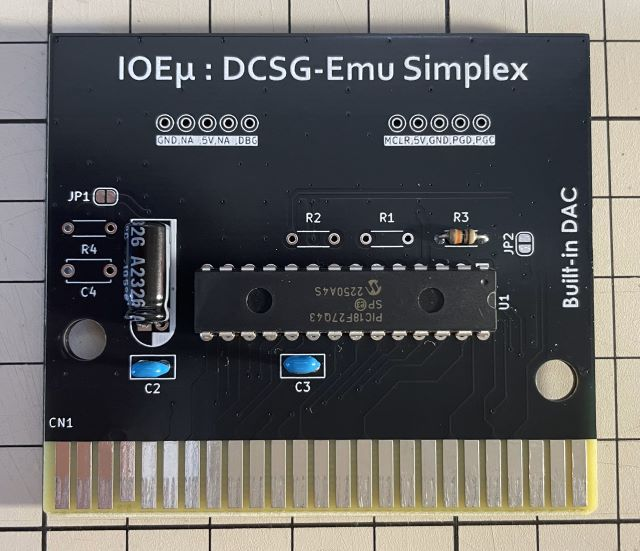
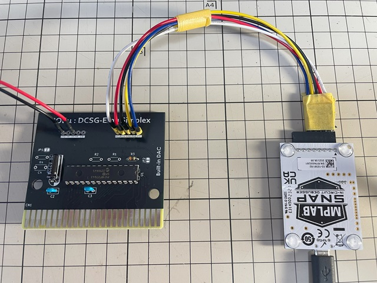
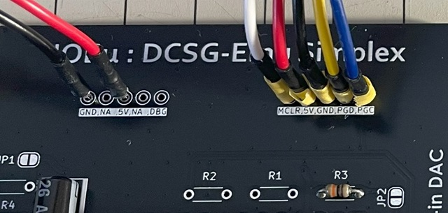
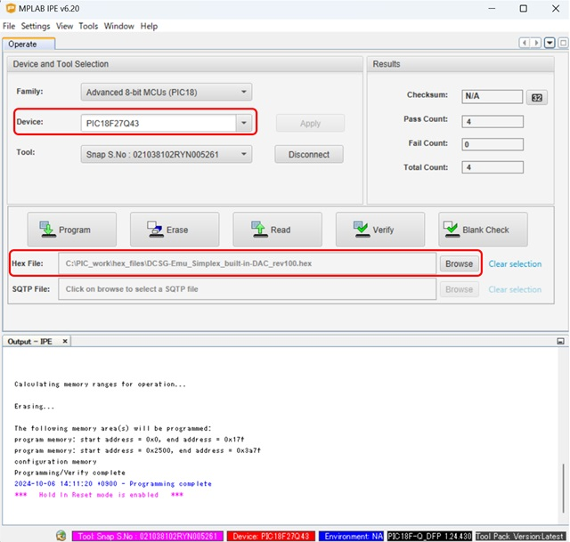

# IOEμ: DCSG-Emu Simplex

## 1. 概要

* DCSG-Emu Simplexは、8-bit PICマイコンによるSN76489AN音源エミュレーターです。
* MSX実機上でSN76489AN互換音源として使用できます。
* サウンド波形の生成には、PICマイコン内蔵DACを使用しています。
* トーン生成は、PICマイコン搭載機能を活用し、4ch(Tone x3 + Noise x1)独立制御を実現しています。
* このため、PICの8-bit CPUの負荷に影響を受けず、安定したtoneを生成できます。
* PICの8-bit CPUは、MSXバスのエミュレーションと波形合成に使用しています。
* MSXのバスアクセスは、可変WAITサイクルを採用し、波形合成、DAC出力を優先する設計です。
* アドレスデコード回路や電源ON時のMUTE回路を必要とせず、DACもPIC内蔵のものを使用しているため、回路は1 chip構成です。
* 加えて、PICマイコンに小型で入手性の良いDIPチップ品を採用しており、安価で組み立ても容易です。(秋月さんで部品は揃います)

## 2. 外観

## 3. 使用方法

MSX本体の電源をオフしてから、空きスロットに**DCSG-Emu Simplex基板**（以下、DCSG-Emu）を挿入して下さい。

制御レジスタは以下のIOポートアドレスにマッピングされています。
制御レジスタの仕様はSN76489ANのデータシート等を参照してください。

|IO-port address|R/W|備考
|--|--|--
|0x3F|W|
|0x7F|W|0x3Fのミラー

## 4. 使用上の注意

### (1) ファームウェアの種類

DCSG-Emuのファームウェアには、サウンド出力方式が異なるDAC版とPWM版の2種類があります。
DAC版は、PIC内蔵8-bit DACのHigh Impedance出力を直接サウンド出力に使用するため、MSX本体によっては音が歪む可能性があります。
DAC版で音が歪むなどの音質異常が発生する場合は、PWM版のファームウェアをお試しください。どちらのファームウェアも基板は共通で使用できます。

※ SCC-Emu Simplex、Multiplexシリーズでは、PIC内蔵DACを使用しておらず、「外付けDAC＋アンプ」構成のため、PWM版は用意していません。

### (2) MSX本体のリセット

DCSG-Emuは、MSX本体のリセット信号を使用していません。
そのため、DCSG-Emuが発音中にリセットすると、その時点で発声していた音が鳴り続けます。
この場合、電源をオフするか、再度、DCSG-Emuの各制御レジスタを初期化して下さい。

### (3) 対応ソフト

DCSG-Emuは、SN76489ANに対応したソフト等（但し、IOポート割り当てが同じもの）であれば動作する可能性があります。例えば、ピーガー伝説さんのMSXπ（但し、MSXπ plus以降は外部DCSG音源は不要）、TINY野郎さんのSG2MSX、GDXさんのSG1000.COM等のソフトウェアがありますが、これらとDCSG-Emuを併用して不具合が発生しても、これらの作者様はDCSG-Emuとは無関係であり、DCSG-Emuに関する問い合わせはしないで下さい。

## 5. PICマイコン用Firmwareの書き込み方法

firmwareフォルダ内の**HEXファイル**は、PICマイコン用のFirmwareです。Firmwareをオンボードで書き込むことも可能です。

**但し、Firmwareをオンボードで書き込む場合、必ず、MSX本体からDCSG-Emuを取り外した状態で行ってください。MSX本体に挿入した状態ではFirmwareの書き込みは出来ません。MSX本体の故障の原因にもなります。**

オンボード書き込みに必要なもの:

* [MPLAB IPE(書込みソフト)](https://www.microchip.com/en-us/tools-resources/production/mplab-integrated-programming-environment)

* [MPLAB SNAP(インサーキットデバッガ/プログラマ)](https://www.microchip.com/en-us/development-tool/pg164100)

* [スルーホール用テストワイヤ TP-200](https://akizukidenshi.com/catalog/g/g109830/)

* 5V出力の安定化電源

IPEソフトウェアは、マイクロチップ製マイコンの統合開発環境[MPLAB X IDE](https://www.microchip.com/en-us/tools-resources/develop/mplab-x-ide)をインストールすると一緒にインストールされます。
SNAPは、FWの書込みに使用します。

SNAPとDCSG-Emuの接続にスルーホール用テストワイヤを使用します。
**テストワイヤ間がショートしないようにピン間を絶縁テープで保護することをお勧めします。**
テストワイヤ TP-200の代わりに2.54mmピッチのL型のピンヘッダ（半田付け）も使用できます。

* SNAPは、以下写真のように基板右側の5個並んだスルーホール群とテストワイヤを使って接続します。
* 信号名は基板上のシルクを参考にして下さい。スルーホールとSNAPの各信号の並びは同じですが、逆順に接続しないように注意ください。
* 安定化電源は、基板左側のスルーホール群の中の5VとGNDのスルーホールをテストワイヤを使って接続し、5Vを給電してください。

**※ Fireware書込み時は絶対にDCSG-EmuをMSX本体に接続しないで下さい。故障の原因になります。また、カードエッジ部を絶縁することをお勧めします（写真の例では絶縁はしていません）。**

PC（IPE）、SNAP、DCSG-Emuを各ケーブルで接続後、firmwareフォルダ内のHEXファイルをIPEを使って書き込みます。
DCSG-Emu Simplex版には、必ず、**built-in DAC**用のHEXファイルを使用してください。

以下を参考に、DeviceとHEXファイルを選択下さい。Deviceは「**PIC18F27Q43**」です。Familyは「Advanced 8-bit MCUs(PIC18)」です。

DeviceとHEXファイルを選択後、「Connect」をクリックするとIPEとDCSG-Emu(PIC18マイコン)がリンクします。その後に「Program」をクリックするとFWの書込みが行われます。

## 6. 基板の発注方法

基板の発注方法を例示しますが、利用者の責任において実施して下さい。[IOEμの免責事項](../readme.md)を参照下さい。

基板メーカーに[JLCPCB](https://jlcpcb.com/jp)を使用される場合は、gerberフォルダ内のZIPファイル（ガーバーファイル）をそのまま[アップロード](https://cart.jlcpcb.com/jp/quote?orderType=1&stencilLayer=2&stencilWidth=100&stencilLength=100)してください。

主な基板仕様は以下の通りです。

* 寸法：ガーバーファイル（ZIPファイル）のアップロードで自動入力されます。
* 層数：2層
* PCB厚さ：1.6mm
* 表面仕上げ：お好みで。ENIGは品質が良いですが、費用は高くなります。
* ビア処理：レジストカバー
* カードエッジコネクタ：YES (表面仕上げでENIGを使用しない場合もYESとしてください)
* 30°端子取り：YES
* 端面スルーホール：No
* エッジメッキ：No

その他の項目はお好みで設定ください。
