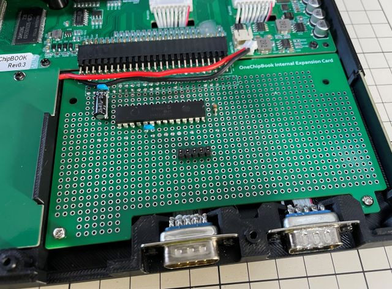

# Universal Board for OneChipBook

OneChipBook向けInternal expansion cardサイズのユニバーサル基板のガーバーデータです。
このUniversal BoardにDCSG-Emu Simplex(PWM版)のファームウェアを書き込んだPICマイコンを実装すればOneChipBookの内蔵スロットに組み込むことも可能です。

※ 本Universal boardは、個人で設計したものであり、OneChipBookの開発元とは一切関係ありません。OneChipBookの開発元には本基板に関する問い合わせはしないで下さい。また、OneChipBookのバージョン違いや、仕様変更があった場合は使用できない可能性があります。ご利用にあたってはIOEμの免責事項をご確認ください。

