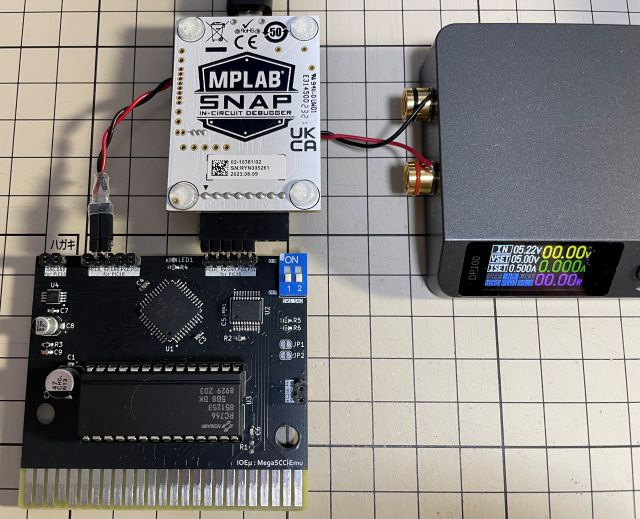

# IOEμ: MegaSCC-Emu 

## 1. 概要

* MegaSCC-Emuは、8-bit PICマイコンによる「KONAMI SCCタイプ MegaROMコントローラ」のエミュレーターです。
* [SCC-Emu Simplex](/SCC-Emu_Simplex_12bit-DAC/readme_scc-emu_12.md)相当のSCC音源エミュレーターも搭載しています。
* 2つの8-bit PICマイコン(Main:PIC18F, Sub:PIC16F)を使ってMegaROMコントローラとSCC音源機能を実現しています。
* 設計コンセプトは「**MASK ROMの再生**」です。
* 過去にSCC対応メガロムゲームを分解した経験のある方、少なからずおられると思います。
* もし、その際の「**MASK ROM**」が捨てられずに保管されていれば、MegaSCC-Emuで再利用できるかもしれません。
* そのMASK ROMをMegaSCC-Emu基板に実装すれば、SCCサウンドも含めて、MSX実機上で遊べるゲームとして復活できる...かも。
* MASK ROMの容量は1Mbitのみに対応しています。（理由は単に作者の手元には1Mbit品しか無かったためです）
* 内部ロジック上は、2Mbit以上の容量も対応可能な構成となっており、ニーズがあれば大容量品の製作も検討するかもしれません。
* SCCレジスタ、BANKレジスタへのアクセスにはWaitが挿入されます。
* 一方でROMのリードアクセスは「**No Wait**」ですので、ゲームプレイに違和感はほとんど出ないと思います。
* モードスイッチによりROMを無効化することもできるため、MGSDRV等で使用できるSCC互換音源としても利用できます。
* 入手性の良い現役の安価なPICマイコンを使用しており、FPGAを利用するより製造コストは低いと思います。但し、何よりも高い再現性を求めるならFPGAです。

## 2. 外観

## 3. 使用方法

**MegaSCC-Emu基板**（以下、MegaSCC-Emu）にKONAMI SCCタイプのMASK ROM（対応ROMに関しては概要を参照）を実装してください。MASK ROMを実装したMegaSCC-EmuをMSX本体の空きスロットに挿入し、MSX本体の電源をオンしてください。通常のゲームROMと同様にゲームが起動します。

また、後述のディップスイッチでROMを無効化すると、SCC互換音源カートリッジとして使用できます。MGSDRV用プレーヤーでお好みのSCCの楽曲を再生ください。MegaSCC-Emuは、SCCとして認識されますが、古いバージョンのMGSDRVをご使用の場合はスロット指定が必要な場合があるようです。その場合はSCC-Emuを挿入したスロット番号を指定してください。

**ぱるぷ(@parupu_x_nagae)さんのゲームミュージック・SCCアレンジ作品がおススメです。**

[ぱるぷさんの作品集](https://parupu.hatenablog.com/archive/category/MSXplay)

基板右上のディップスイッチ（青色）はブートモード設定用です。このスイッチは電源オフ時にのみ設定出来ます。
通電中にスイッチを変更しても機能設定は変更されません。なお、全てオフで使用する場合はディップスイッチを実装する必要はありません。

以下、ディップスイッチの機能です。

|SW#|OFF|ON|備考
|--|--|--|--
|SW1|DAC rate : Normal|DAC rate : High| SCC用DACの再生周波数を選択します。通常、Normalで使用してください。
|SW2|ROM Enable|ROM Disable| ROMをDisableにするとゲームは起動せずにSCC互換音源として利用できます。

基板上端中央のLED（LED1）は、2つのPICマイコン、PIC18F（U1）とPIC16F（U2）の両方が正常に起動すると緑色で点灯しますが、それ以上の意味も機能もありませんので実装する必要はありません。

## 4. 使用上の注意

### (1) 動作確認済みのMASK ROM

* 激突ペナントレース (RC757)
* 激突ペナントレース2 (RC766)

### (2) 動作確認済みのMSX本体

以下のMSXで動作することを確認しています。

* CX5F(MSX1) + MSX➋代 (ピーガー伝説さんのMSXバージョンアップアダプタ)
* 1chipMSX オリジナル版（※FPGAバージョンアップ無し）
* HB-F1XDJ turboR upgrade版
* FS-A1GT

以下のMSXでは残念ながら動作しません。※ バス信号を確認するとWait信号の取り込みタイミングが上記のMSXや1chipMSXのオリジナル版とは異なるようです（Waitのセットアップタイムが厳しくなっている？）。

* OneChipBook と OCM-PLD v3.9.2、v3.9.1の組み合わせ

### (3) MSX本体のリセット

MegaSCC-Emuは、MSX本体のリセット信号を使用していません。
そのため、MegaSCC-Emuが発音中にリセットすると、その時点で発声していた音が鳴り続けます。
リセットを使用せずに電源をオフしてください。

## 5. PICマイコン用Firmwareの書き込み方法

firmwareフォルダ内の**HEXファイル**は、PICマイコン用のFirmwareです。
PIC18F(U1)用とPIC16F(U2)用の2種類のfirmewareがあり、それぞれ別々に書き込む必要があります。
オンボードでのFirmware書き込み方法は以下を参考にしてください。

**Firmwareをオンボードで書き込む場合、必ず、MSX本体からMegaSCC-Emuを取り外した状態で行ってください。MSX本体に挿入した状態ではFirmwareの書き込みは出来ません。MSX本体の故障の原因にもなります。**

オンボード書き込みに必要なもの:

* [MPLAB IPE(書込みソフト)](https://www.microchip.com/en-us/tools-resources/production/mplab-integrated-programming-environment)

* [MPLAB SNAP(インサーキットデバッガ/プログラマ)](https://www.microchip.com/en-us/development-tool/pg164100)

* [スルーホール用テストワイヤ TP-200](https://akizukidenshi.com/catalog/g/g109830/)

* 5V出力の安定化電源

IPEソフトウェアは、マイクロチップ製マイコンの統合開発環境[MPLAB X IDE](https://www.microchip.com/en-us/tools-resources/develop/mplab-x-ide)をインストールすると一緒にインストールされます（IPEのみを選択インストール可能です）。
SNAPは、FWの書込みに使用します。
SNAPの代わりに[PICkit BASIC](https://www.microchip.com/en-us/development-tool/pg164110)等も使用できます。

SNAPとMegaSCC-Emuの接続にスルーホール用テストワイヤ、又は2.54mmピッチのL型のピンヘッダ（半田付け）を使用します。
**テストワイヤを使用する場合は、ピン間がショートしないようにピン間を絶縁テープで保護することをお勧めします。**

基板にはSNAPと接続するための「2.54mmピッチで5個並んだスルーホール群」が、基板上端に2つあります。基板に向かって左がPIC18F（U1）書込み用、右がPIC16F（U2）書込み用です。書き込みは最初にPIC16F(U2)から行ってください。その次にPIC18F（U1）の書込みを行ってください。
電源は書き込まない方のスルーホール群中の5VとGNDを使用して使って給電してください。以下の写真を参考にして下さい。写真の例ではL形のピンヘッダを使用しています。

* 信号名は基板上のシルクを参考にして下さい。スルーホールとSNAPの各信号の並びは同じですが、逆順に接続しないように注意ください。
* 安定化電源は、書き込まない方法のスルーホール群内の5VとGNDのスルーホールを使って接続し、5Vを給電してください。

**※ Fireware書込み時は絶対にSCC-EmuをMSX本体に接続しないで下さい。故障の原因になります。また、カードエッジ部を絶縁することをお勧めします（写真の例では絶縁はしていません）。**

PC（IPE）、SNAP、MegaSCC-Emuを各ケーブルで接続後、firmwareフォルダ内のHEXファイルをIPEを使って書き込みます。
PIC18(U1)の書込みにはPIC18用のHEXファイル、PIC16(U2)の書込みにはPIC16用のHEXファイルを使用してください。

以下を参考に、DeviceとHEXファイルを選択下さい。DeviceはPIC18（U1）が「**PIC18F47Q43**」（Family: Advanced 8-bit MCUs）、PIC16（U2）が「**PIC16F13145**」（Family: Mid-Range 8-bit MCUs）です。

DeviceとHEXファイルを選択後、「Connect」をクリックするとIPEとMegaSCC-EmuのPICマイコンがリンクします。その後に「Program」をクリックするとFWの書込みが行われます。

## 6. 基板の発注方法

基板の発注方法を例示しますが、利用者の責任において実施して下さい。[IOEμの免責事項](../readme.md)を参照下さい。

基板メーカーに[JLCPCB](https://jlcpcb.com/jp)を使用される場合は、gerberフォルダ内のZIPファイル（ガーバーファイル）をそのまま[アップロード](https://cart.jlcpcb.com/jp/quote?orderType=1&stencilLayer=2&stencilWidth=100&stencilLength=100)してください。

主な基板仕様は以下の通りです。

* 寸法：ガーバーファイル（ZIPファイル）のアップロードで自動入力されます。
* 層数：2層
* PCB厚さ：1.6mm
* 表面仕上げ：お好みで。ENIGは品質が良いですが、費用は高くなります。
* ビア処理：レジストカバー
* カードエッジコネクタ：YES (表面仕上げでENIGを使用しない場合もYESとしてください)
* 面取り：30°
* 端面スルーホール：No
* エッジメッキ：No

その他の項目はお好みで設定ください。

