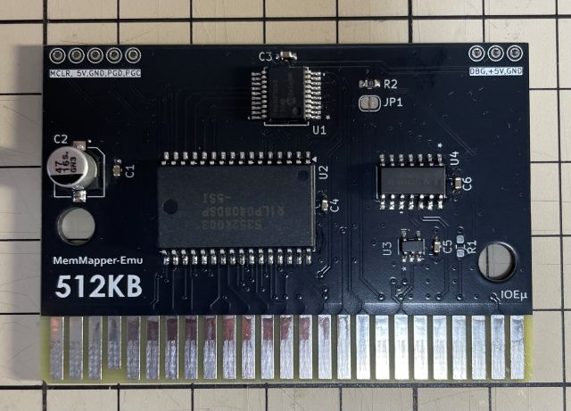
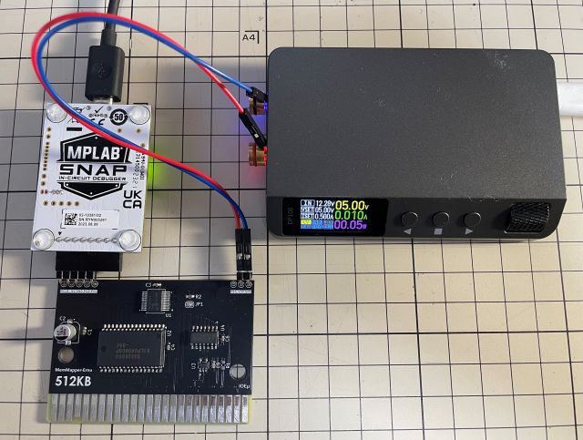
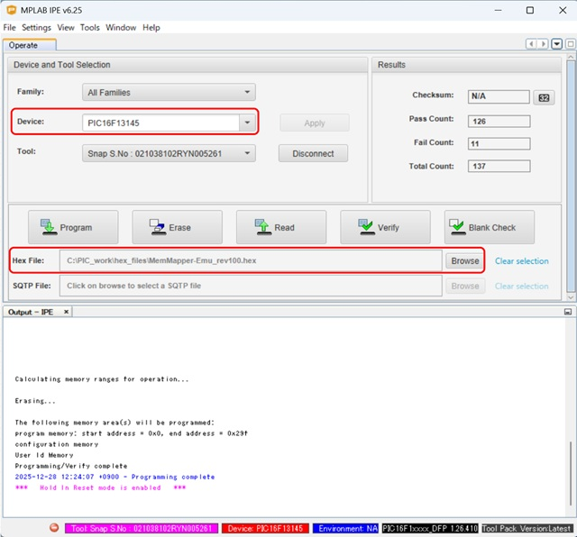

# IOEμ: MemMapper-Emu 

## 1. 概要

* IOEμ: MemMapper-Emuは、8-bit PICマイコン(PIC16F13145)で制御するMSX実機用の拡張RAMです。
* 8-bit PICマイコンを用いることで通常のロジックICで構成するよりも部品点数を削減しています。
* RAM容量は512Kbyteです。
* RAMのアクセスに対してはPIC側がWAITサイクルを追加することはありません。
* 但し、IOポートの0xFC～0xFFh（マッパーセグメント選択レジスタ）のアクセスにはWAITを挿入します。
* セグメントを連続で切り替えてそれを繰り返すような特殊な用途でもない限り、通常の用途にはWAITの影響はないと思います。
* 入手性の良い安価なPICマイコンを使用しており、その周辺回路も含めて、2025年現在でもDigikeyで入手可能な部品で設計しています。

## 2. 外観

## 3. 使用方法

基本的な使い方は一般的なMSX用の拡張RAMと同じです。MSX本体の電源をオフにしてからスロットにカートリッジを挿入し、電源をオンしてください。

## 4. 使用上の注意

### (1) 動作確認済みのMSX本体、及びカートリッジ

以下のMSX、及び互換機で起動することを確認しています。但し、turboR、MeSXはその仕組み上本体内蔵RAMを使う方が高速です。

＜本体＞
* FS-A1GT (turboR)
* HB-F1XDJ (MSX2+)
* CX5F (MSX1) 
* MeSX (MSX1相当)

### (4) MSX本体のリセット

MemMapper-Emuは、MSX本体のリセット信号を使用していません。回路図上にリセット信号接続用のJP1がありますが、これも接続しないで下さい。

## 5. PICマイコン用Firmwareの書き込み方法

firmwareフォルダ内の**HEXファイル**は、PICマイコン用のFirmwareです。
オンボードでのFirmware書き込み方法は以下を参考にしてください。

**Firmwareをオンボードで書き込む場合、必ず、MSX本体からMemMapper-Emuを取り外した状態で行ってください。MSX本体に挿入した状態ではFirmwareの書き込みは出来ません。MSX本体の故障の原因にもなります。**

オンボード書き込みに必要なもの:

* [MPLAB IPE(書込みソフト)](https://www.microchip.com/en-us/tools-resources/production/mplab-integrated-programming-environment)

* [MPLAB SNAP(インサーキットデバッガ/プログラマ)](https://www.microchip.com/en-us/development-tool/pg164100)

* [スルーホール用テストワイヤ TP-200](https://akizukidenshi.com/catalog/g/g109830/)

* 5V出力の安定化電源

IPEソフトウェアは、マイクロチップ製マイコンの統合開発環境[MPLAB X IDE](https://www.microchip.com/en-us/tools-resources/develop/mplab-x-ide)をインストールすると一緒にインストールされます（IPEのみを選択インストール可能です）。
SNAPは、FWの書込みに使用します。
SNAPの代わりに[PICkit BASIC](https://www.microchip.com/en-us/development-tool/pg164110)等も使用できます。

SNAPとMemMapper-Emuの接続にスルーホール用テストワイヤ、又は2.54mmピッチのL型のピンヘッダ（半田付け）を使用します。
**テストワイヤを使用する場合は、ピン間がショートしないようにピン間を絶縁テープで保護することをお勧めします。**

基板にはSNAPと接続するための「2.54mmピッチで5個並んだスルーホール群」が基板左上（カードエッジ部を下とした場合）にあります。電源は、基板右上の3個並んだスルーホール群の中の5VとGNDのスルーホールを使用して5Vを給電してください。以下の写真を参考にして下さい。写真の例ではL形のピンヘッダを使用しています。

* 信号名は基板上のシルクを参考にして下さい。スルーホールとSNAPの各信号の並びは同じですが、逆順に接続しないように注意ください。

**※ Fireware書込み時は絶対にMemMapper-EmuをMSX本体に接続しないで下さい。故障の原因になります。また、カードエッジ部を絶縁することをお勧めします（写真の例では絶縁はしていません）。**

PC（IPE）、SNAP、MemMapper-Emuを各ケーブルで接続後、firmwareフォルダ内のHEXファイルをIPEを使って書き込みます。

以下を参考に、DeviceとHEXファイルを選択下さい。Deviceは「**PIC16F13145**」（Family: Mid-Range 8-bit MCUs）です。

DeviceとHEXファイルを選択後、「Connect」をクリックするとIPEとMemMapper-EmuのPICマイコンがリンクします。その後に「Program」をクリックするとFWの書込みが行われます。

## 6. 基板の発注方法

基板の発注方法を例示しますが、利用者の責任において実施して下さい。[IOEμの免責事項](../readme.md)を参照下さい。

基板メーカーに[JLCPCB](https://jlcpcb.com/jp)を使用される場合は、gerberフォルダ内のZIPファイル（ガーバーファイル）をそのまま[アップロード](https://cart.jlcpcb.com/jp/quote?orderType=1&stencilLayer=2&stencilWidth=100&stencilLength=100)してください。

主な基板仕様は以下の通りです。

* 寸法：ガーバーファイル（ZIPファイル）のアップロードで自動入力されます。
* 層数：2層
* PCB厚さ：1.6mm
* 表面仕上げ：お好みで。ENIGは品質が良いですが、費用は高くなります。
* ビア処理：レジストカバー
* カードエッジコネクタ：YES (表面仕上げでENIGを使用しない場合もYESとしてください)
* 面取り：30° （基板サイズが小さいため選択できない場合があります。その場合は面取り無しとしてください）
* 端面スルーホール：No
* エッジメッキ：No

その他の項目はお好みで設定ください。

