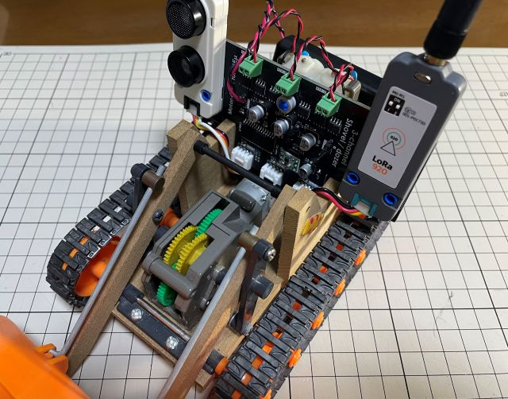

# Motor-Driver Unit for IOEμ

Motor-Driver Unitは、IOEμ:Multiplexに搭載するGroveポートを経由して制御可能な工作用ブラシ付きDCモーターのドライバ基板です。3つのモーターを駆動できます。また、MSX0 Stack/Cardから制御することも可能です。

現時点で回路図とガーバーデータのみ公開しています。
マニュアル、ファームウェア等は準備中です。後日公開予定です。

[使用例 (XへのLink)](https://x.com/kickstate7/status/1900792398537781665)

※ Motor-Driver Unitは、タミヤ社の[SHOVEL/DOZER](https://www.tamiya.com/japan/products/70107/index.html)への組み込みを想定し設計されていますが、本基板は個人で設計したものであり、本基板はタミヤ社とは一切関係ありませんので、タミヤ社には本基板に関する問い合わせはしないで下さい。ご利用にあたってはIOEμの免責事項をご確認ください。