# Motor-Driver Unit for IOEμ

## 1. 概要

* Motor-Driver Unitは、[IOEμ:Multiplex 3-in-1 MO](/Multiplex_3-in-1_MO/readme_multiplex_3-in-1_mo.md)に搭載するGroveポートを使用して制御可能な工作用ブラシ付きDCモーターのドライバー基板です。
* 3つのモーターを独立して制御・駆動できます。
* また、Motor-Driver UnitはGroveポートを3ポート搭載しており、無線通信ユニットやセンサーを接続可能です。
* 無線ユニットやセンサーユニットをMotor-Driver Unitに搭載すれば、センサーデータを無線を使ってMSXで取得できます。
* Groveポートを搭載する[MSX0](https://camp-fire.jp/projects/648742/view) Stack/Cardから制御することも可能です
* [Remo-Con Unit](/RemoCon_Unit/readme_remocon_unit.md)を使用すると、2つのアナログスティックを使った各モーターの繊細な操作や、加速度センサーを使った操作も楽しめます。
* Motor-Driver Unitは簡単なコマンド使って制御できるため、これらの機器以外でも様々な機器から制御可能です。
* 実際の動作の様子は、[こちら (XへのLink)](https://x.com/kickstate7/status/1900792398537781665)をご参照ください。MSX0 Card(試作品)を使った使用例です。

## 2. 外観・組み立て

### 2.1. Motor-Driver Unit基板

Motor-Driver Unit基板の電源には単3乾電池2本（直列接続）を使用します。
Motor-Driver Unit基板には電源スイッチはないため、スイッチ付きの電池BOXを利用してください。

* [スイッチ付き電池BOX:型番SBH-321-3AS150](https://akizukidenshi.com/catalog/g/g111523/)

回路図では電源入力はMotor Ch-AとCh-B用、Ch-Cとマイコン用で分けてありますが、通常は共通で問題ありません。
電池BOXの配線を基板上のJ4に+,-のシルクと極性を合わせて半田付けし、JP1のジャンピンは接続（ショート）してください。
この場合、J5は未使用です。

Motor-Driver Unit基板とM5社の各ユニットは、レゴブロックの[テクニック軸-コネクターペグ](https://brickers.jp/products/43093-023)と[テクニック ブッシュ](https://brickers.jp/products/4265c-194)を使えば固定できます。

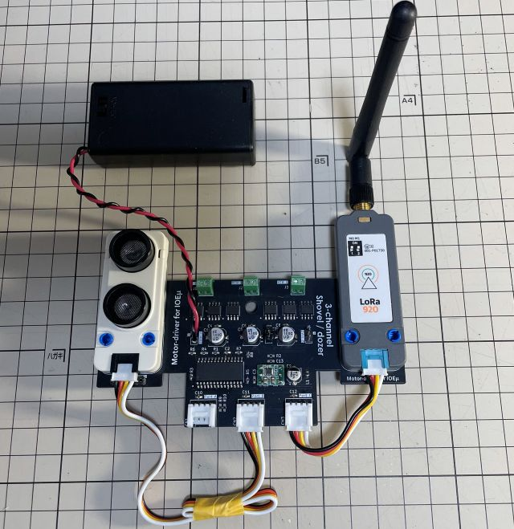

### 2.2. Motor-Driver Unit基板の組込例

Motor-Driver Unitは、タミヤ社の[SHOVEL/DOZER](https://www.tamiya.com/japan/products/70107/index.html)に簡単に組み込めます。

SHOVEL/DOZERの背面板にあるケーブルの通し穴とMotor-Drive Unit基板上の切穴を使ってMotor-Drive Unit基板をSHOVEL/DOZERに固定します。その際、レゴブロックの[テクニック軸-コネクターペグ](https://brickers.jp/products/43093-023)と[テクニック ブッシュ](https://brickers.jp/products/4265c-194)を使用すると簡単に固定出来ます。SHOVEL/DOZERの背面板にあるケーブルの通し穴の径が少し小さいため、加工する必要がありますが、木材のため、加工も容易です。
電池BOXは下の写真ではSHOVEL/DOZER後部のモーターBOXにマジックテープで固定していますが、搭載可能な場所に設置してください（基板前方に置くだけでも良いかもしれません）。

モータ駆動用のポートは基板上端に3ポートあり、Ch-A、Ch-Bはクローラー駆動（走行）用です。Ch-Cはショベルの昇降用です。モーターのケーブル極性は後述の制御コマンドやサンプルプログラムや使って動作を確認しながら正転、逆転を合わせてください。

モーターのノイズ対策のために、電池、モーター用のケーブルはツイストし、モーター本体の電極と金属シールド缶にコンデンサ（0.047u～0.1uF程度）を写真を参考に半田付けしてください。

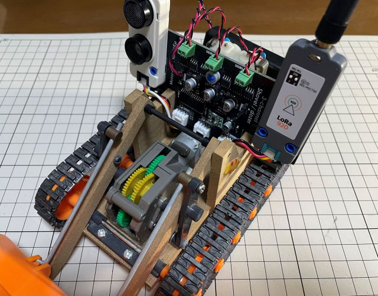

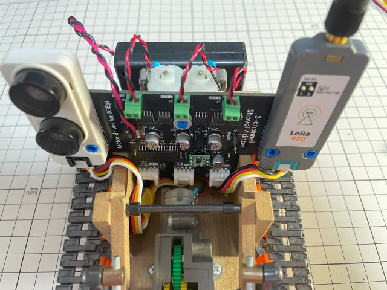

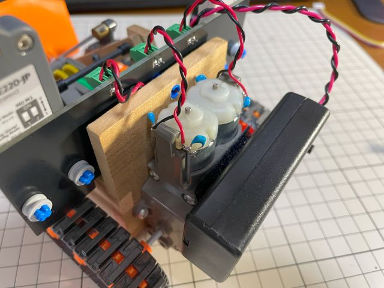

※ Motor-Driver Unitは、タミヤ社の[SHOVEL/DOZER](https://www.tamiya.com/japan/products/70107/index.html)への組み込みを想定し設計されていますが、本基板は個人で設計したものであり、タミヤ社とは一切関係ありません。ご利用にあたってはIOEμの免責事項をご確認ください。

## 3. 使用方法

### 3.1. Groveポート

Motor-Driver Unitは、Groveポートを3ポート搭載しており、このGroveポートにシリアル通信、無線ユニット、センサーユニット等を接続して使用します。

#### (1) 通信用ポート

GroveポートのPort C（回路図、基板シルク参照）がシリアル通信（UART）用のポートです。
このシリアル通信I/Fを使用してMotor-Drive Unitにコマンド（後述）を送信することで3chのモーターを制御します。

シリアル通信(UART)の設定は **9600bps,8N1形式**です。

UARTに対応する無線モジュールを使用すれば、無線操作でモーターを制御することもできます。
無線モジュールは、M5Stack社の[LoRaユニット Unit LoRaE220-920](https://docs.m5stack.com/en/unit/LoRaE220-JP%20Unit)で動作確認を行っています。LoRaユニットを使用すればLongRangeでのリモコン操作、リモートセンシングも可能（かも？）です。
LoRaユニットを使わずに[Groveケーブル](https://docs.m5stack.com/en/accessory/cable/grove_cable)で接続する場合は、ケーブルをクロス加工（白と黄色のケーブルを入れ替える）して、Port-Cに接続してください。
Muletiplexのスライドスイッチ（Groveポートの電源スイッチ）は、LoRaユニットを接続する場合は「ON」、ケーブル接続の場合は「OFF」にしてください。

#### (2) 汎用ポート

GroveポートのPort B（3つのポートうち、真ん中のポート）は汎用入出力ポートです。
現時点では、[超音波センサー Unit Ultrasonic-IO](https://docs.m5stack.com/en/unit/UNIT%20SONIC%20IO)のみに対応しています。

#### (3) I2C用ポート

Port-AはI2C用ポートとして使用予定ですが、現時点で未使用ですので、何も接続しないで下さい。
※ 現在はデバッグ用に使用していますので、I2Cデバイスは接続しないで下さい。故障の原因になります。

### 3.2. Motor-Driver Unitの制御コマンド

Motor-Driver Unitの制御コマンドは、MSX-BASICでも負荷をかけずに使用出来るように、 **1命令＝1バイト** で構成しています。

下表にコマンド一覧を示します。
これらのコマンドをシリアル通信でMotor-Drive Unitに送信することで簡単に3chのモーターを制御できます。
コマンドのフレーミングは不要です。1バイト単位でコマンドを送信してください。但し、LoRaユニットを使用する場合は、LoRaユニットの制約により、1回（サイレントタイムアウトが発生しない条件で最大32bytes）の送信毎に送信休止期間が50ms発生しますので、コマンド送信間隔は100ms程度を開けてください。LoRaユニットを使用せずにGroveケーブル（クロス）で接続する場合は、この制約はありません。

|COMMAD名|値|機能|備考
|--|--|--|--
|NOP|0x00|No Operation|通信切断判定(KeepAlive)やコマンド記録の同期に使用します|
|STOP|0x01|Motor Ch-A, Ch-B 停止|走行モーター停止|
|FORWARD|0x02|Motor Ch-A, Ch-B 正転|前進|
|REVERSE|0x03|Motor Ch-A, Ch-B 逆転|後進|
|BREAK|0x04|Motor Ch-A, Ch-B ブレーキ|機能予約|
|FRIGHT|0x05|Motor Ch-A 停止, Ch-B 正転|右方向転換（正転）|
|FLEFT|0x06|Motor Ch-A 正転, Ch-B 停止|左方向転換（正転）|
|RRIGHT|0x07|Motor Ch-A 逆転, Ch-B 停止|右方向転換（逆転）|
|RLEFT|0x08|Motor Ch-A 停止, Ch-B 逆転|左方向転換（逆転）|
|RTURN|0x09|Motor Ch-A 逆転, Ch-B 正転|右回転|
|LTURN|0x0A|Motor Ch-A 正転, Ch-B 逆転|左回転|
|LIFTSTP|0x0B|Motor Ch-C 停止|ショベル リフト停止|
|LIFTUP|0x0C|Motor Ch-C 正転|ショベル リフトアップ|
|LIFTDWN|0x0D|Motor Ch-C 逆転|ショベル リフトダウン|
|LIFTBRK|0x0E|Motor Ch-C ブレーキ|機能予約|
|RESV|0x0F|-|コマンド予約|
|REC|0x10|コマンド記録|使用条件：1命令の送信間隔 0.1s|
|PLAY|0x11|コマンド再生|記録された命令を0.1s周期で再生（NOP含む）|
|RPSTOP|0x12|コマンド記録再生停止||
|SNS1E|0x13|センサー1(超音波センサー) ON/OFFトグル|コマンド応答：0x55 ON, 0x00 OFF|
|SNS1G|0x14|センサー1(超音波センサー) データ取得|コマンド応答：16-bitデータを下位バイト、上位バイトの順に転送|
|RESV|0x15 - 0x1F|-|センサー系コマンド予約|
|ACC|0x20 - 0x3F|Motor Ch-A, Ch-B PWM DUTY調整 32段階(下位5bits)|Motor Ch-A, Ch-B同値同時設定|
|STOPA|0x40|Motor Ch-A 停止|モーターCh-A 単体制御（停止）|
|FORWARDA|0x41|Motor Ch-A 正転|モーターCh-A 単体制御（正転）|
|REVERSEA|0x42|Motor Ch-A 逆転|モーターCh-A 単体制御（逆転）|
|BREAKA|0x43|Motor Ch-A ブレーキ|モーターCh-A 単体制御（機能予約）|
|RESV|0x44 - 0x5F|-|コマンド予約|
|ACCA|0x60 - 0x7F|Motor Ch-A PWM DUTY調整 32段階(下位5bits)|モーターCh-A単体制御（PWM）|
|STOPB|0x80|Motor Ch-B 停止|モーターCh-B 単体制御（停止）|
|FORWARDB|0x81|Motor Ch-B 正転|モーターCh-B 単体制御（正転）|
|REVERSEB|0x82|Motor Ch-B 逆転|モーターCh-B 単体制御（逆転）|
|BREAKB|0x83|Motor Ch-B ブレーキ|モーターCh-B 単体制御（機能予約）|
|RESV|0x84 - 0x9F|-|コマンド予約|
|ACCB|0xA0 - 0xBF|Motor Ch-B PWM DUTY調整 32段階(下位5bits)|モーターCh-B 単体制御（PWM）|
|STOPC|0xC0|Motor Ch-C 停止|モーターCh-C 単体制御（停止）|
|FORWARDC|0xC1|Motor Ch-C 正転|モーターCh-C 単体制御（正転）|
|REVERSEC|0xC2|Motor Ch-C 逆転|モーターCh-C 単体制御（逆転）|
|BREAKC|0xC3|Motor Ch-C ブレーキ|モーターCh-C 単体制御（機能予約）|
|RESV|0xC4 - 0xDF|-|コマンド予約|
|ACCC|0xE0 - 0xFF|Motor Ch-C PWM DUTY調整 32段階(下位5bits)|モーターCh-C 単体制御（PWM）|

### 3.3. LoRaユニットのパラメータ設定

 [LoRaユニット  Unit LoRaE220-920](https://docs.m5stack.com/en/unit/LoRaE220-JP%20Unit)をMotor-Drive Unitで使用するためには、初回の1回だけパラメータ設定が必要です。

 パラメータ設定を行うにはLoRaユニットの動作モードをMode3（Config/DeepSleepモード）に変更する必要があります。動作モードはLoRaユニット本体のディップスイッチで切り替えます。無線通信時（通常利用時）は**Mode 0**に設定し、パラメータ設定時は**Mode 3**に設定します。
 
パラメータ設定はMode3の状態でLoRaユニットの各レジスタに以下の値を書き込みます。この設定値は、送信機(IOEμ側)のLoRaユニット、受信機（Motor-Driver Unit側）のLoRaユニットともに**同じ値**にする必要があります。

※ LoRaユニットの設定環境がない場合は、MSX本体とIOEμ（Multiplex 3-in-1 MO）を使って設定できます。詳細は/MISC/LoRa_Unitフォルダ内の[readme_lora_unit.md](/MISC/LoRa_Unit/readme_lora_unit.md)を参照ください。

|レジスタ名|Address|値|備考
|--|--|--|--
|ADDH|0x00|0x00|Default|
|ADDL|0x01|0x00|Default|
|REG0|0x02|0x62|UART: 9600bps (8N1形式), AIR: 62500bps, SF: 5, BW: 500kHz|
|REG1|0x03|0xC0|サブパケット長: 32Bytes, RSSI: 無効, TxPower: 13dBm|
|REG2|0x04|0x00|Channel: 0 ※0ch-12chの範囲で設定。13ch以上はMotor-Drive unitでは使用不可|
|REG3|0x05|0x00|RSSIバイト: 無効, トランスペアレント送信モード, WOR: 500ms|
|CRYPT_H|0x06|0x5A|暗号鍵：お好きな値|
|CRYPT_L|0x07|0x3C|暗号鍵：お好きな値|

### 3.4. Motor-Driver Unit制御用サンプルプログラム

#### (1) MSX＋IOEμ:Multiplex用
[MOTOR.BAS](/MotorDriver_Unit/sample_MSX-BASIC/MOTOR.BAS)は、IOEμ:Miltiplex用のBASICプログラムのサンプルです。前述のコマンドを使用してMSXでMotor-Drive Unitを制御するプログラムです。操作方法は、プログラムを実行すると画面に表示されます。

※ 現時点での制約：LoRaユニットを使用した場合に双方向通信（センサー値取得）が安定しません。これはLoRaユニットで使用している[特定小電力無線モジュール E220-900T22S(JP) ](https://support.dragon-torch.tech/e220-900t22sjp-qa/)のトランスペアレント送信モードにおける既知の問題によるものです。対処方法は検討中です。尚、LoRaユニットを使用せずにGroveケーブルでクロス接続する場合には双方向通信も問題なく、センサー値取得も安定して行えます。また、LoRaユニットを使用する場合も、モーター制御（単方向通信）は問題ありません。

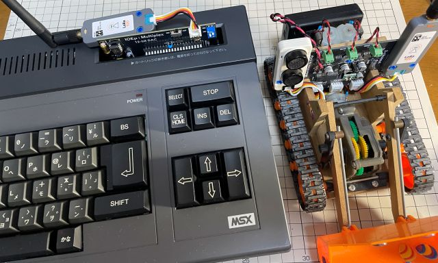

#### (2) Remo-Con Unit用
[Remo-Con Unit](/RemoCon_Unit/readme_remocon_unit.md)にFWを書き込み、Remo-Con UnitのGroveポートのPort Cに初期設定済みのLoRaユニットを接続するとすぐにMotor-Driver Unitの操作を楽しめます。
Remo-Con Unitに搭載するアナログスティックを使って繊細な操作が可能です。また、Remo-Con UnitのPort Aに[6軸センサー Unit Mini IMU](https://docs.m5stack.com/en/unit/imu)を接続すれば基板を前後左右に傾けることでクローラー駆動用モーターの操作が出来るようになります。

* 右アナログスティック：前後で右クローラー、左右でショベルの昇降制御が出来ます。速度制御に対応します。
* 左アナログスティック：前後で左クローラーの制御（速度制御対応）、押し込みで「アナログスティックによる操作」と「加速度センサーによる操作」が切り替わります。
* 加速度センサー：基板を前後左右に傾けて前進、後進、右回転、左回転を制御出来ます。加速度センサーでのショベルの昇降は現時点で未対応です。

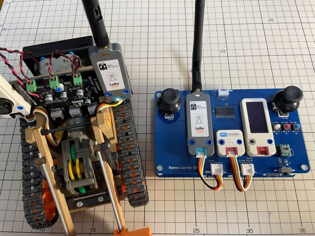

#### (3) MSX0 Stack用
[MTR_MSX0.BAS](/MotorDriver_Unit/sample_MSX-BASIC/MOTOR.BAS)は、MSX0用のBASICプログラムのサンプルです。
MSX0 StackのGroveポートは青色のポート（Port-C）を使用してください。

操作方法、現時点の制約は(1)のMSX＋IOEμ:Multiplex用と同じです。「(1) MSX＋IOEμ:Multiplex用」を参照下さい。
また、MSX0 Stackはキー数が少ないのでキー割り当てを変更すると操作性は改善すると思います。BASICプログラムですのでお好みで変更してください。

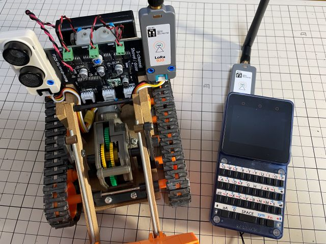

#### (4) MSX0 Card用
[MTR_MSX0.BAS](/MotorDriver_Unit/sample_MSX-BASIC/MOTOR.BAS)は、MSX0用のBASICプログラムのサンプルです。
MSX0 CardのGroveポートは初期状態ではI2Cになっていますので、MSX0 Cardに搭載するSetup UtilityでGroveポートの動作をUARTに変更して下さい。

操作方法、現時点の制約は(1)のMSX＋IOEμ:Multiplex用と同じです。「(1) MSX＋IOEμ:Multiplex用」を参照下さい。
また、MSX0 CARDは画面が小さい一方でキー数は多いので、Stackよりもコマンドのキー割り当ての自由度は高いです。お好みで変更してください。

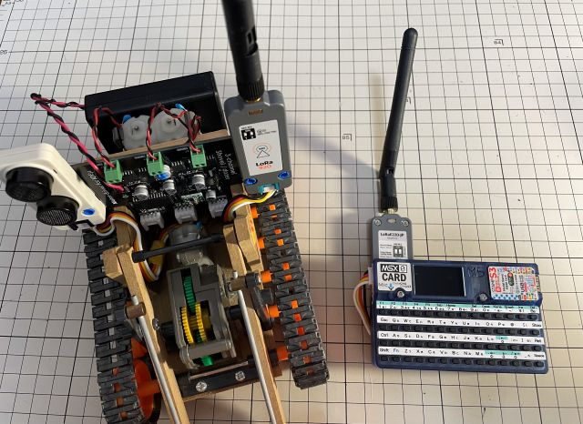

## 4. 使用上の注意

* MotorDriver Unitを使用しない場合は、電池BOXのスイッチをオフにするか、電池を取り外してください。
* Motor-Drive Unitには電源用LEDが搭載されていないため、スイッチの切り忘れにご注意ください。電池の過放電に繋がります。

## 5. PICマイコン用Firmwareの書き込み方法

firmwareフォルダ内の**HEXファイル**は、PICマイコン用のFirmwareです。Firmwareをオンボードで書き込むことも可能です。

**但し、Firmwareをオンボードで書き込む場合、必ず、Motor-Driverr UnitからモーターやGroveポートの接続を外した状態で基板単体で行ってください。モーターやGroveポートを接続した状態でF/Wを書き込むと誤動作や故障の原因になります。**

オンボード書き込みに必要なもの:

* [MPLAB IPE(書込みソフト)](https://www.microchip.com/en-us/tools-resources/production/mplab-integrated-programming-environment)

* [MPLAB SNAP(インサーキットデバッガ/プログラマ)](https://www.microchip.com/en-us/development-tool/pg164100)

* [スルーホール用テストワイヤ TP-200](https://akizukidenshi.com/catalog/g/g109830/)

* [単3乾電池2本とスイッチ付き電池BOX](https://akizukidenshi.com/catalog/g/g111523/)

IPEソフトウェアは、マイクロチップ製マイコンの統合開発環境[MPLAB X IDE](https://www.microchip.com/en-us/tools-resources/develop/mplab-x-ide)をインストールすると一緒にインストールされます。
SNAPは、FWの書込みに使用します。
SNAPの代わりに[PICkit BASIC](https://www.microchip.com/en-us/development-tool/pg164110)等も使用できます。

SNAPとMotor-Driver Unitの接続にスルーホール用テストワイヤを使用します。
**テストワイヤ間がショートしないようにピン間を絶縁テープで保護することをお勧めします。**
テストワイヤ TP-200の代わりに2.54mmピッチのL型のピンヘッダ（半田付け）も使用できます。

* 信号名は基板上のシルクを参考にして下さい。スルーホールとSNAPの各信号の並びは同じですが、逆順に接続しないように注意ください。
* FW書込み時は電池BOXから給電します。スイッチ付き電池BOXのスイッチをONにしてください。

**※ Fireware書込み時は必ずモーター、及びGroveポートの接続を外した状態で行ってください。モーターやGroveポートを接続した状態でFWを書き込むと誤動作や故障の原因になります。**

以下はテストワイヤを使用せずにL型ピンヘッダを使用する場合の例です。

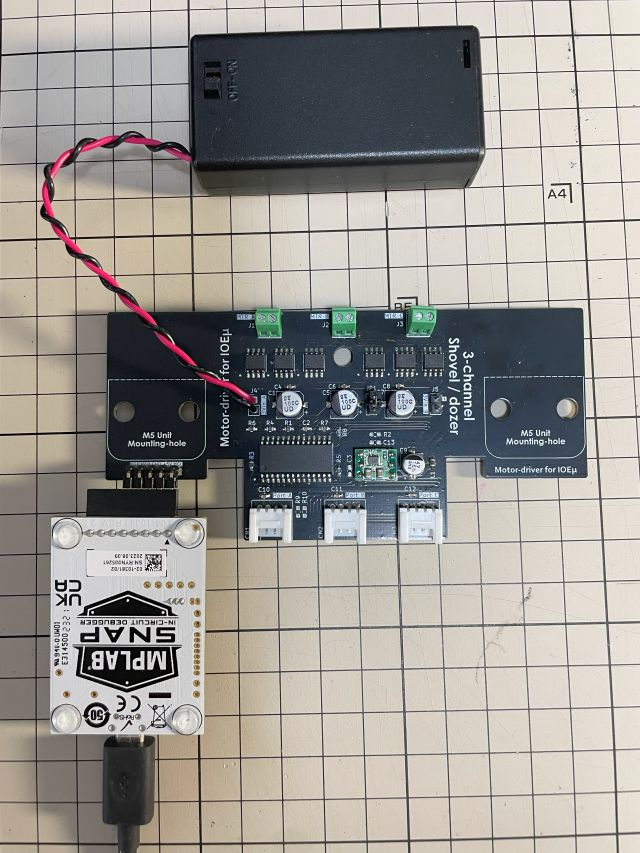

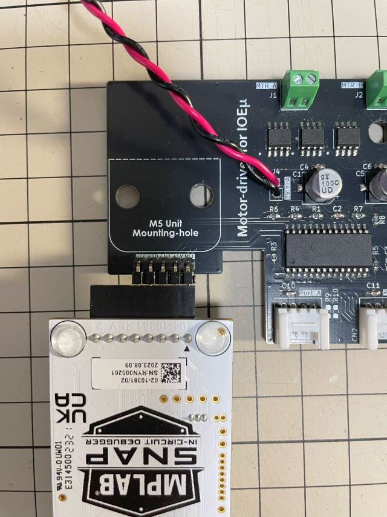

PC（IPE）、SNAP間をケーブルで接続後、Motor-Driver Unitの電源をオンし、firmwareフォルダ内のHEXファイルをIPEを使って書き込みます。

以下を参考に、DeviceとHEXファイルを選択下さい。Deviceは「**PIC18F27Q43**」です。Familyは「Advanced 8-bit MCUs(PIC18)」です。

DeviceとHEXファイルを選択後、「Connect」をクリックするとIPEとMultiplex(PIC18マイコン)がリンクします。その後に「Program」をクリックするとFWの書込みが行われます。

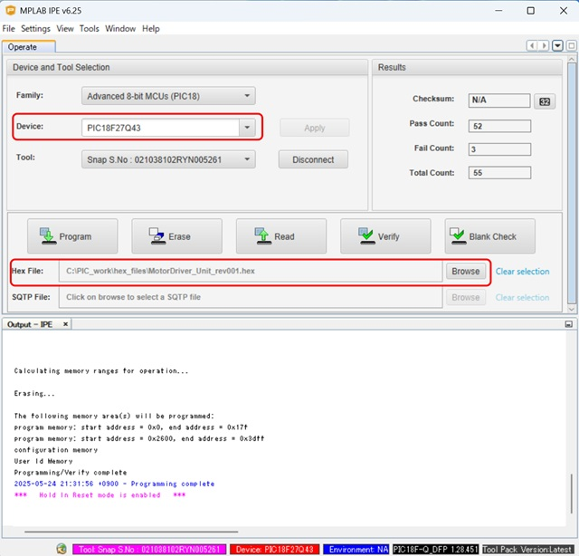

## 6. 基板の発注方法

基板の発注方法を例示しますが、利用者の責任において実施して下さい。[IOEμの免責事項](../readme.md)を参照下さい。

基板メーカーに[JLCPCB](https://jlcpcb.com/jp)を使用される場合は、gerberフォルダ内のZIPファイル（ガーバーファイル）をそのまま[アップロード](https://cart.jlcpcb.com/jp/quote?orderType=1&stencilLayer=2&stencilWidth=100&stencilLength=100)してください。

主な基板仕様は以下の通りです。

* 寸法：ガーバーファイル（ZIPファイル）のアップロードで自動入力されます。
* 層数：2層
* PCB厚さ：1.6mm
* 表面仕上げ：お好みで。ENIGは品質が良いですが、費用は高くなります。
* ビア処理：レジストカバー
* カードエッジコネクタ：No
* 30°端子取り：No
* 端面スルーホール：No
* エッジメッキ：No

その他の項目はお好みで設定ください。
