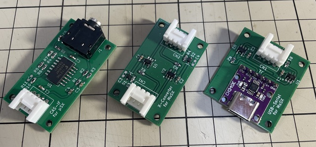
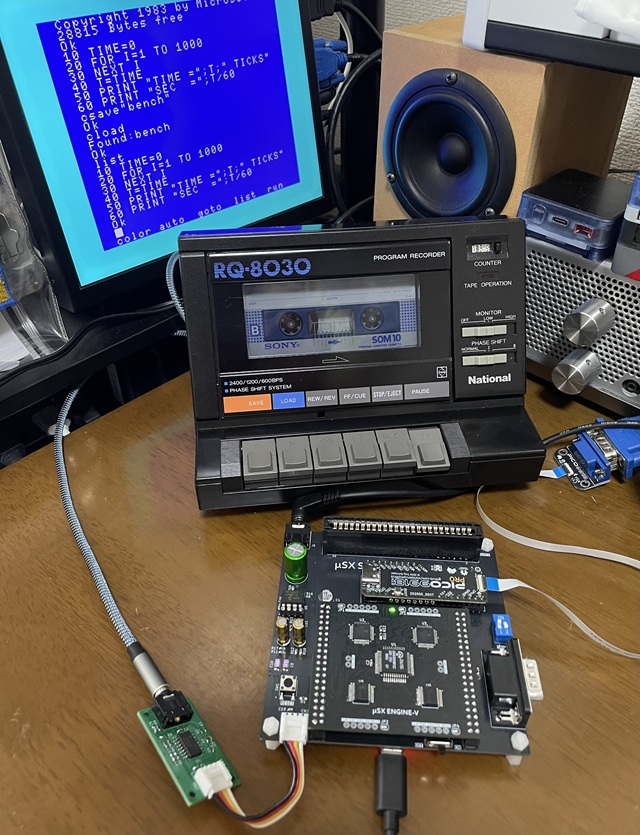
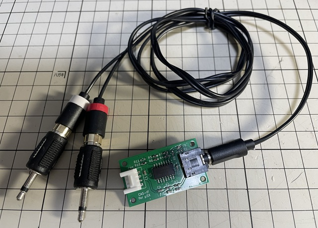
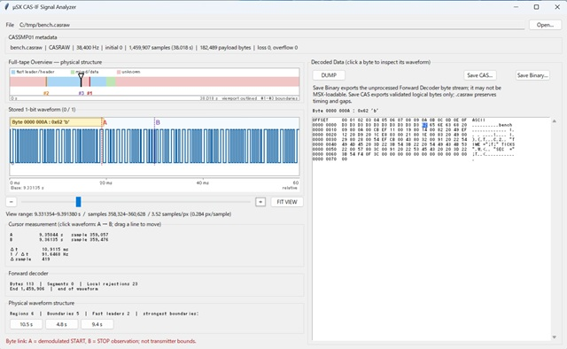

# OptionBoard for μSX

## 1. 概要

### 1.1. CAS-IF基板

* CAS-IF基板は、μSXにカセットテープI/F機能を追加するGroveモジュールです。
* μSXのGroveポートに接続して使用します。
* CAS-IF基板を経由してμSXにデータレコーダーと接続できます。
* また、M5Stack社の[AtomU](https://docs.m5stack.com/ja/core/ATOM%20U)を用いるとデータレコーダーをPCに接続することも出来ます。
* 「データレコーダー + CAS-IF基板 + AtomU + PC」の接続構成でテープデータをPCにバックアップできます。
* おまけツールとして、BACKUP、DUMP（CAS変換）、CAS逆変換の3つのツール（Windows用）を用意しています。

**※ 使用上の制約: μSX の MAIN-RON を ROM-Emu で動作させている場合は、ボーレートは 1200 までとして下さい。**

### 1.2. X-Converter基板

* X-Converter基板は、Gorveポート間をクロス接続するための基板です。
* クロス接続に加えて、5V信号を3.3V CMOSレベルに変換し、ポート間の電源も分離します。
* X-Converter基板を使用することで、5V-IO の μSX と 3.3V-IO の AtomU を安全に接続できます。
* X-Converter基板と[AtomU](https://docs.m5stack.com/ja/core/ATOM%20U)をセットで使用することで、PCをデータレコーダーの代わりとしてμSXに接続できます。
* 「μSX + X-Converter基板 + AtomU + PC」の構成においても、前述のBACKUPツールを利用できます。
* また、開発中のμSX REMO-CONのテープ機能でも使用します。

### 1.3. USB-Serial Converter基板

 　準備中

## 2. 外観

以下、外観写真です。

左：CAS-IF基板、中：X-Converter基板、右：USB-Serial Converter基板（準備中）

 

## 3. 使用方法

### 3.1. CAS-IF基板

#### (1) μSXとデータレコーダーを接続する場合

μSXのGroveポートにCAS-IF基板を接続し、CAS-IF基板の 3.5mm stereo jack に 3.5mm plug対応のステレオケーブルを接続します。ステレオケーブルは「3.5mmステレオから3.5mmモノラルx2（二股）への変換」ケーブルを使用してください。

変換後の3.5mm plug モノラルケーブル（赤と白）をデータレコーダの**MIC**端子(赤色ケーブル)と再生用端子(白色ケーブル)に接続します。

「3.5mm stereo plug / 3.5mm mono plug x2」変換ケーブルが入手できない場合は、「3.5mm stereo plug / RCA x2」変換ケーブルにRCA/3.5mm plug変換アダプタを装着しても利用できます。

注意：赤色のケーブルは「MIC」端子に接続します。LINE入力には非対応です（信号レベルが異なります）。

使用例：
* [μSXとデータレコーダーの接続](https://x.com/kickstate7/status/2091067214560694689)
* [テープゲーム起動](https://x.com/kickstate7/status/2091121465865429255)

**※ 使用上の制約: μSXのMAIN-RONをROM-Emuで動作させている場合は、ボーレートは1200までとして下さい。**

#### (2) PCとデータレコーダーを接続する場合

M5Stack社の[AtomU](https://docs.m5stack.com/ja/core/ATOM%20U)が必要です。その代わり、アナログ入力ベースのWAVファイルではなく、1-bit DIGITAL RAW Sampling形式(サンプリング周波数:38.4KHz)でPCにバックアップ出来ます。

接続構成例 ： データレコーダー + AtomU + PC 

※ AtomUがEOLとなったため、他のAtom対応や代替も検討中です。

詳細は、後述の「CAS-IF TAPE Backup」等のツール同梱のReadmeを参照ください。

使用例：
* [AtomUとの接続](https://x.com/kickstate7/status/2091474018503467155)
* [BACKUPデータの書き戻し](https://x.com/kickstate7/status/2093591945042157632)

### 3.2. X-Converter基板

主にμSXとPCを接続する場合に使用します。μSXとPC間をX-ConverterとAtomUを使ってブリッジ接続します。
X-Converter基板は、Gorveポート間をクロス接続するための基板ですが、クロス接続に加えて、5V信号を3.3V CMOSレベルに変換し、ポート間の電源も分離しますので、5V-IO の μSX と 3.3V-IO の AtomU を安全に接続できます。

詳細は、後述の「CAS-IF TAPE Backup」等のツール同梱のReadmeを参照ください。

接続構成例 ： μSX + X-Converter基板 + AtomU + PC 

使用例：
* [μSXとPCの接続](https://x.com/kickstate7/status/2093656150164287781)
* [μSX REMO-CON（開発中）](https://x.com/kickstate7/status/2102266657418924238)

### 3.3. USB-Serial Converter基板

　準備中。

## 4. TOOLS

CAS-IF、X-Converterを活用するために、以下のツールを[TOOLSフォルダ](/MuSX_OptionBoard/tools/)に用意しています。
使用方法や詳細は、各ツールに同梱されているReadmeを参照ください。

* CAS-IF TAPE Backup : テープデータのバックアップ、再生等に使用します。
* CAS-IF Signal Analyzer : バックアップデータ(RAWデータ)をDUMPし、CASフォーマットに変換します。
* CAS2RAW Converter : CASフォーマットのデータをCAS-IF基板で使用できるRAWデータに逆変換します。

ツールの使用例：CAS-IF Signal Analyzer

## 5. 基板の発注方法

基板の発注方法を例示しますが、利用者の責任において実施して下さい。[IOEμの免責事項](../readme.md)を参照下さい。

基板メーカーに[JLCPCB](https://jlcpcb.com/jp)を使用される場合は、gerberフォルダ内のZIPファイル（ガーバーファイル）をそのまま[アップロード](https://cart.jlcpcb.com/jp/quote?orderType=1&stencilLayer=2&stencilWidth=100&stencilLength=100)してください。

主な基板仕様は以下の通りです。OptionBoardの場合はカードエッジ等の特殊条件はありませんので、アップロード後の自動設定のままでもOKです。

* 寸法：ガーバーファイル（ZIPファイル）のアップロードで自動入力されます。
* 層数：2層
* PCB厚さ：1.6mm
* 表面仕上げ：お好みで。ENIGは品質が良いですが、費用は高くなります。
* ビア処理：レジストカバー

その他の項目はお好みで設定ください。

