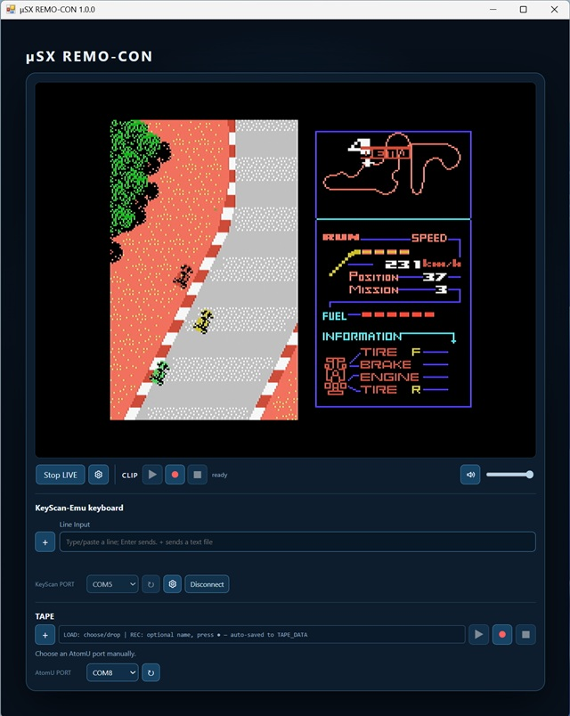
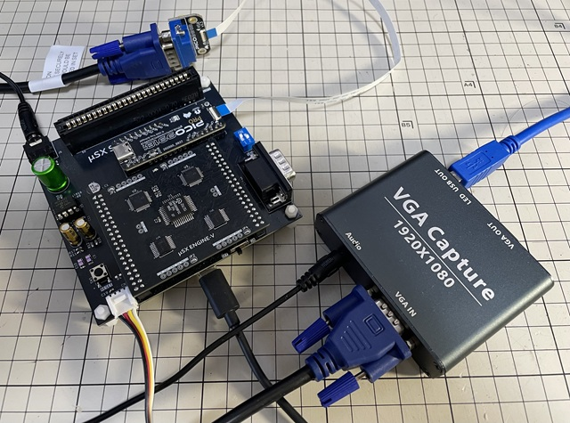

# μSX REMO-CON

## 1. 概要

μSX REMO-CON は、実機 μSX の VGA 画面と音声を PC 上で確認しながら、キーボード入力などを PC から操作するための Windows アプリケーションです。LIVE表示、CLIP、Key入力、TAPE などを一つの画面にまとめ、実機 μSX を PC から扱いやすくすることを目的としています。

μSX REMO-CONを使用すると、キーボード、モニタをPCと共有できます。さらに、外部機器との連携機能として、ESERAMairによるファイル転送（PC → μSX）にも対応しています。

μSXの画面と音声は、VGA Captureを用いてキャプチャしますが、実機検証では、**ATCCPYDM製 VGA to USB 3.0 キャプチャーボード（型番：V2U-LO）**を使用し、**640×480・4:3**で動作を確認しました。この機器は **UVC (USB Video Class) / UAC (USB Audio Class)** に対応し、Windows 標準ドライバーで認識されるため、通常は専用ドライバーのインストールは不要です。

## 2. 使用方法

[App/MuSX_REMO-CON-1.0.0-win-x64.zip](/MuSX_REMO-CON/App/)に同梱する readme.md / readme_ja.md を参照してください。必要とする環境、使い方等の詳細が記載されています。

使用例：　※Xへのリンクです。

* [キャプチャデバイス選択](https://x.com/kickstate7/status/2104127126412939457)
* [KeyScanによるTXTファイル転送](https://x.com/kickstate7/status/2102174752677020017)
* [KeyのLine入力時の履歴機能](https://x.com/kickstate7/status/2101996045890957805)
* [TAPE機能](https://x.com/kickstate7/status/2102266657418924238)
* [プレイ動画CLIP機能](https://x.com/kickstate7/status/2102384784328753361)
* [ESERAMair連携](https://x.com/kickstate7/status/2102167692107252113)

