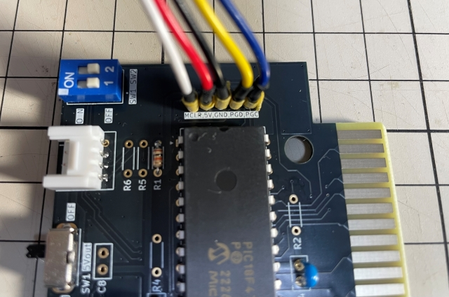

# IOEμ: Multiplex 3-in-1 MO

## 1. 概要

* IOEμ Multiplex 3-in-1 MOは、SCCとDCSGに対応した8bit PICマイコンによる音源エミュレータです。
* 加えて、Groveコネクタを1port搭載しており、このPortをMIDI出力用に使用できます。※別途、MIDI-I/F変換基板が必要です。
* MSX実機上でMGSDRV用のSCC互換音源、ゲーム用のDCSG互換音源として使用でき、MIDIは、いかたまさんの「MIDRY」で再生できることを確認しています。
* SimplexシリーズのSCC-Emu、DCSG-Emu、及びMIDI-OUTの3つの機能を1つの8-bit PICマイコン「PIC18F47Q83」に実装しています。
* SCCとDCSGのサウンド波形の生成には、12-bit DACを使用しています。
* SCCとDCSGは、仕様上は同時発声も可能です。
* トーン生成は、PICマイコン搭載機能を活用し、SCC 5ch、DCSG 4chの各ch(Tone 8ch + Noise 1ch)の独立制御を実現しています。
* このため、PICの8-bit CPUの負荷に影響を受けず、安定したtoneを生成できます。
* PICの8-bit CPUは、MSXバスのエミュレーションと波形合成に使用しています。
* MSXのバスアクセスは、可変WAITサイクルを採用し、波形合成、DAC出力を優先する設計です。
* 12-bit DACには部品に入手性の良いDIPチップを採用しており、安価で組み立ても容易です。

## 2. 外観

## 3. 使用方法

### (1) 使い方
MSX本体の電源をオフしてから、空きスロットに**IOEμ: Multiplex 3-in-1 MO基板**（以下、Multiplex）を挿入し、MGSDRV用プレーヤーでのSCC楽曲の再生、MSX実機で動作するSG1000エミュレータ等でのDCSG対応ゲーム、MIDRYでのMIDI再生をお楽しみください。

* MultiplexはMGSDRV用プレーヤーでSCCとして認識されますが、古いバージョンのプレーヤーをご使用の場合はスロット指定が必要な場合があるようです。その場合はMultiplexを挿入したスロット番号を指定してください。
* SCCとDCSGはDACで再生されますが、DACの再生周波数はディップスイッチで設定変更できます（後述）。
* MIDI-OUTの利用にはGroveコネクタに接続できるMIDI-IF基板が別途必要です（後述）。
* MIDRY利用時はオプションに「/i6」を指定して下さい。DOS2のプロンプトで「midry /i6」を実行してください。

**ぱるぷ(@parupu_x_nagae)さんのゲームミュージック・SCCアレンジ作品がおススメです。**

[ぱるぷさんの作品集](https://parupu.hatenablog.com/archive/category/MSXplay)

### (2) IOポートアドレス

MultiplexではDCSG、MIDI等の制御レジスタがIOポートに割り当てられており、以下のIOポートアドレスを使用します。

|IO-port address|R/W|備考
|--|--|--
|0x10-0x1f|R/W|MIDI制御他
|0x3F|W|DCSGの制御レジスタ
|0x7F|W|0x3Fのミラー

* DCSGの制御レジスタの仕様はSN76489ANのデータシート等を参照してください。

### (3) 基板の設定：ディップスイッチ

基板右上のディップスイッチ（青色）はブートモード設定用です。このスイッチは電源オフ時にのみ設定出来ます。
通電中にスイッチを変更しても機能設定は変更されません。
なお、全てオフで使用する場合はディップスイッチを実装する必要はありません。

以下、ディップスイッチの機能です。

|SW#|OFF|ON|備考
|--|--|--|--
|SW1|Default|-| SW1はOFFで使用してください。
|SW2|44kHz固定 (SCCとDCSGの同時発声が可能)|最大80kHz (自動調整)| SW2でDACの再生周波数を選択します。

* SCCとDCSGの同時発声は、SW2でDACの再生周波数を「44KHz固定」に設定した場合にのみ可能です。
* SW2を「最大80KHz」に設定し、SCCとDCSGが同時に使用された場合は、SCCの発声が優先されます。

### (4) Groveコネクタ

“Multiplex 3-in-1 MO”では、GroveコネクタをMIDI出力ポートとして利用できます。また、FWアップデートの際には5V電源の入力用としても使用できます。

* MIDI機器との接続には、別途、Groveコネクタに接続できるMIDI-IF変換基板等が必要です。
* GroveコネクタのPin#2にUARTのTxが割り当てられています。現状、Pin#1のMIDI入力は未使用です。
* スライドスイッチSW1は、Groveコネクタ用の電源スイッチです。ONでGroveコネクタの5Vピン(Pin#3)とMSXの5V電源が繋がり通電されます。
* Groveコネクタからの逆方向給電(Grove -> Multiplex)も可能ですが、MultiplexをMSXに接続した状態では逆方向通電は絶対にしないで下さい。MSX本体の故障の原因となります。
* FWアップデートの際にGroveコネクタから5Vを入力する場合、必ず、MultiplexをMSX本体から取り外してください。

Multiplexは以下の基板との組み合わせで動作を確認しています。これらの中でM5Stack社のUnit-SynthはGroveコネクタに直接接続できるMIDI音源ですので手軽にMIDIを楽しめます。

* [M5Stack Unit-Synth](https://docs.m5stack.com/ja/unit/Unit-Synth)
* [necobit MIDI Unit Mini for GROVE](https://necobit.com/denshi/midi-unit-mini-for-grove/)
* [necobit MIDI Unit for GROVE](https://necobit.com/denshi/grove-midi-unit/)
* [IoTメディアラボラトリ MIDIアダプタ ver 2.0](https://www.kadenken.com/view/item/000000001837)

## 4. 使用上の注意

### (1) MSX本体のリセット

Multiplexは、MSX本体のリセット信号を使用していません。
そのため、SCC、DCSGが発音中にMSX本体をリセットすると、その時点で発声していた音が鳴り続けます。
この場合、電源をオフするか、再度、MGSDRVで再生、DCSGの各レジスタを初期化すると正常状態に戻ります。

### (2) SCC対応ソフト

SCC機能は、SCC互換のためMGSDRV以外でも使用できる可能性ありますが、MGSDR以外での利用は未検証です。SofarunでもExternal SCCとして認識されますが、ゲームで多用されるチャネルイネーブル（ミュート）を使用した「効果音」でSCC-EmuのBus-Waitの影響を受ける可能性があります。ゲームで使用する場合、DACの再生周波数を44kHz固定に設定するとBus-Waitの影響を軽減できます。また、SCCをPCMとして使用する応用例があるようですが、PCMでの利用は想定しておらず、現時点では対応していません。

### (3) DCSG対応ソフト

DCSG機能は、SN76489ANに対応したソフト等（但し、IOポート割り当てが同じもの）であれば動作する可能性があります。例えば、ピーガー伝説さんのMSXπ（但し、MSXπ plus以降は外部DCSG音源は不要）、TINY野郎さんのSG2MSX、GDXさんのSG1000.COM等のソフトウェアがありますが、これらとMultiplexを併用して不具合が発生しても、これらの作者様はMultiplexとは無関係であり、Multiplexに関する問い合わせはしないで下さい。

### (4) MIDI対応ソフト

MIDI出力機能は、MIDRYでのみ動作検証を行っていますが、Multiplexと併用して不具合が発生しても、MIDRYの作者様はMultiplexとは無関係であり、Multiplexに関する問い合わせはしないで下さい。また、MIDRYのIFオプションは現状では「/i6」のみに対応しています。

## 5. PICマイコン用Firmwareの書き込み方法

firmwareフォルダ内の**HEXファイル**は、PICマイコン用のFirmwareです。Firmwareをオンボードで書き込むことも可能です。

**但し、Firmwareをオンボードで書き込む場合、必ず、MSX本体からSCC-Emuを取り外した状態で行ってください。MSX本体に挿入した状態ではFirmwareの書き込みは出来ません。MSX本体の故障の原因にもなります。**

オンボード書き込みに必要なもの:

* [MPLAB IPE(書込みソフト)](https://www.microchip.com/en-us/tools-resources/production/mplab-integrated-programming-environment)

* [MPLAB SNAP(インサーキットデバッガ/プログラマ)](https://www.microchip.com/en-us/development-tool/pg164100)

* [スルーホール用テストワイヤ TP-200](https://akizukidenshi.com/catalog/g/g109830/)

* [GROVE 4ピン ジャンパオスケーブル](https://www.switch-science.com/products/6245)

* 5V出力の安定化電源

IPEソフトウェアは、マイクロチップ製マイコンの統合開発環境[MPLAB X IDE](https://www.microchip.com/en-us/tools-resources/develop/mplab-x-ide)をインストールすると一緒にインストールされます。
SNAPは、FWの書込みに使用します。

SNAPとMultiplexの接続にスルーホール用テストワイヤを使用します。
**テストワイヤ間がショートしないようにピン間を絶縁テープで保護することをお勧めします。**
テストワイヤ TP-200の代わりに2.54mmピッチのL型のピンヘッダ（半田付け）も使用できます。

* SNAPは、以下写真のように基板右側の5個並んだスルーホール群とテストワイヤを使って接続します。
* 信号名は基板上のシルクを参考にして下さい。スルーホールとSNAPの各信号の並びは同じですが、逆順に接続しないように注意ください。
* FW書込み時の5V電源はGroveコネクタから給電します。Groveコネクタ用の4ピン・ジャンパ・オスケーブル等使って安定化電源を接続し、5Vを給電してください。給電時はスライドスイッチSW1をONにします。

**※ Fireware書込み時は絶対にMultiplexをMSX本体に接続しないで下さい。故障の原因になります。また、カードエッジ部を絶縁することをお勧めします（写真の例では絶縁はしていません）。**

テストワイヤを使用せずにL型ピンヘッダを使用する場合は、以下のように接続します。

PC（IPE）、SNAP、Multiplexを各ケーブルで接続後、firmwareフォルダ内のHEXファイルをIPEを使って書き込みます。

以下を参考に、DeviceとHEXファイルを選択下さい。Deviceは「**PIC18F47Q83**」です(SimplexシリーズのDeviceとは異なります)。Familyは「Advanced 8-bit MCUs(PIC18)」です。

DeviceとHEXファイルを選択後、「Connect」をクリックするとIPEとMultiplex(PIC18マイコン)がリンクします。その後に「Program」をクリックするとFWの書込みが行われます。

## 6. 基板の発注方法

基板の発注方法を例示しますが、利用者の責任において実施して下さい。[IOEμの免責事項](../readme.md)を参照下さい。

基板メーカーに[JLCPCB](https://jlcpcb.com/jp)を使用される場合は、gerberフォルダ内のZIPファイル（ガーバーファイル）をそのまま[アップロード](https://cart.jlcpcb.com/jp/quote?orderType=1&stencilLayer=2&stencilWidth=100&stencilLength=100)してください。

主な基板仕様は以下の通りです。

* 寸法：ガーバーファイル（ZIPファイル）のアップロードで自動入力されます。
* 層数：2層
* PCB厚さ：1.6mm
* 表面仕上げ：お好みで。ENIGは品質が良いですが、費用は高くなります。
* ビア処理：レジストカバー
* カードエッジコネクタ：YES (表面仕上げでENIGを使用しない場合もYESとしてください)
* 30°端子取り：YES
* 端面スルーホール：No
* エッジメッキ：No

その他の項目はお好みで設定ください。
