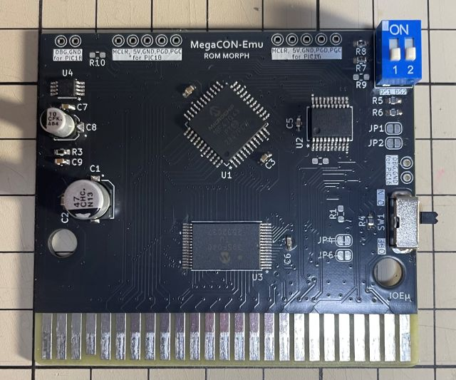
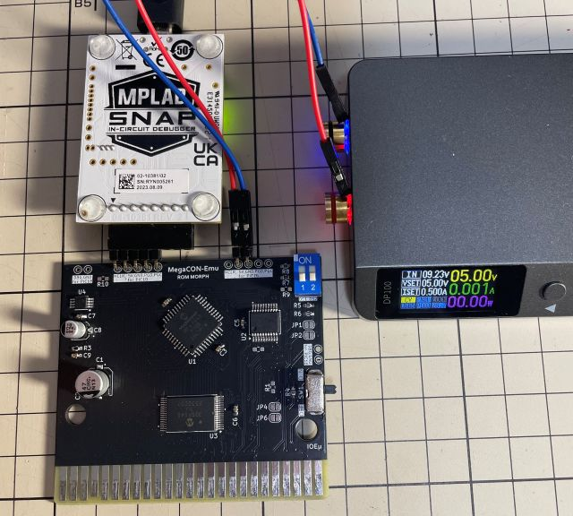
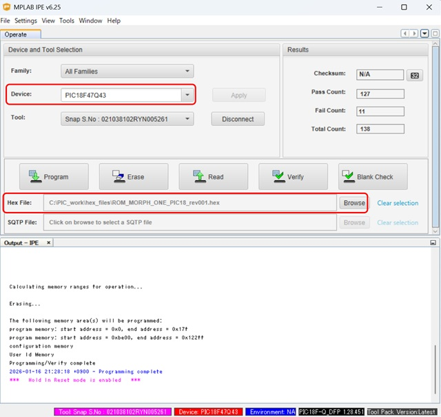

# IOEμ: ROM MORPH – Multi-Mapper Support with 4Mbit Flash-ROM

## 1. 概要

* ROM MORPHは、8-bit PICマイコンによるMulti-Mapper対応MegaROMコントローラエミュレーターを搭載したFlash ROMカートリッジです。
* 2つの8-bit PICマイコン(Main:PIC18F, Sub:PIC16F)を使用し、SCC-Emu、Voice DAC、各種メモリバンク制御等の機能を実現しています。
* MSX実機で使用できます。
* Flash-ROM容量は4Mbitです。Max 4MbitのSingle-bnak modeとMax 2Mbit/bankの2-bank modeに対応しています。
* (要望が多ければ、Max 1Mbit/bankの4-bank modeにも対応するかもしれません。)
* Mapper-Typeは、KONAMI-SCC、KONAMI(非SCC)、ASCII8K、ASCII16K、R-TYPE、NORMAL-ROMの6種類に対応しています。
* Mapper-Typeの切り替えは、専用のDOSコマンドで行い、その設定はROM MORPHの不揮発性メモリ(PIC内蔵)に保存されます。
* Simplexシリーズの[SCC-Emu](/SCC-Emu_Simplex_12bit-DAC/readme_scc-emu_12.md)相当が搭載されており、KONAMI-SCC MapperではSCCサウンドの再生も可能です。
* また、Voice DAC機能も搭載しており、KONAMI(非SCC)、NORMAL Mapperでは一部ソフトで音声再生も可能です。
* 例えば、新世サイザー、牌の魔術師ではVoice DACによる発声が可能です。
* SCCレジスタ、BANKレジスタへのアクセスにはWaitが挿入されますが、Flash ROMへのアクセスにはROM MORPHはWaitを挿入しません。
* このため、8-bit PICによるエミュレーションでもゲームプレイへの違和感は少なく抑えられていると思います（ゼロではありません）。
* 入手性の良い現役の安価なPICマイコンを使用しており、その周辺回路も含めて、2026年現在でも入手可能な部品で設計しています。
* 4MbitのFlash ROMもDigikeyで入手できます（2026年1月時点）。

## 2. 外観




## 3. 使用方法

お手持ちのROMのバックアップデータや自作ROMデータを書き込むことで通常のMSX用のROMカートリッジと同様に使用出来ます。
貴重なレトロROMは直接使用せずに保管し、遊ぶ際にはROM MORPHを使う、自作のソフトをROM化する等を想定しています。

使用例は[こちら](https://x.com/kickstate7/status/2009621579244974472)。※Ｘへのリンクです。

### (1) Flash-ROM書込み方法

専用のDOSコマンド[RMBURN.COM](tools/)を使用してROM MORPHのFlash-ROMに任意データを書き込みます。書き込みデータのMapper-Typeは何であっても構いません。データはRAWデータとして書き込み、Mapper-Typeは後述の別コマンドで設定します。但し、2Mbitを超えるROMデータを書き込み場合は、書き込み前に「Max 4MbitのSingle-bank mode」に変更しておく必要があります。以下、書き込み手順です。専用コマンドはDOS1でも使用できます。
書き込み時間はデータ容量次第ですが、1Mbitでも数分掛かります。

※ ROM MORPHをはじめて使用する際は、Flash-ROMへの書き込みの前にPIC16、PIC18のfirmwareの書き込みを先に行う必要があります。「5. PICマイコン用Firmwareの書き込み方法」に従って、PICマイコンのfirmwareの書き込みを行って下さい。

1. MSX本体の電源をオフしてから、ROM MORPHを基本スロットの1または2に挿入してください。※ 書き込みツールは拡張スロットに対応していません。
2. ROM MORPH基板右端のスライドスイッチ(SW1)をオフにしてMSXを起動してください。SW1をオフにするとROMから起動しません。
3. DOS起動後、スライドスイッチ(SW1)を再度**オン**にしてください。SW1は基板端にあるため、操作しずらいと思いますが、なんとかお願いします。
4. 2Mbitを超えるデータを書き込む場合は、予め「Single-bank mode」に設定しておく必要があります。(2)のMapper-Type設定方法を参照ください。
5. 「2-bank mode」で書き込む場合は、予めディップスイッチ(DS1)を書き込み対象のバンク(bank1 or bank2)に設定してください。(3)のスイッチ類を参照ください。
6. DOSプロンプトで、RMBURN <ファイル名> [S1|S2] を実行してください。Sオプションはスロット指定です。Sオプションを省略した場合はスロット1が選択されます。
7. 書き込み中は簡易プログレスとして「*」が4Kbyte毎に表示されます。
8. 書き込み完了後、完了メッセージが表示されます。
9. 書き込んだROMに合わせてMapper-Typeを設定して下さい。Mapper-Typeの設定は(2)を参照して下さい。

書き込みコマンド：
```DOS
RMBURN <file> [S1|S2] [E]
```
* 本コマンドは、DOS1でも使用可能です。各パラメータに小文字も使用できます。
* Sオプション：ROM MORPHを挿した基本スロットを指定。指定なしの場合はスロット1となります。
* Eオプション：書込み前にFlash-ROM全体を消去します。Eオプション無しの場合は書き込み対象領域のみを部分消去（ページ消去）します。
* スロット1にROM MORPHを挿している場合は、オプション無しで以下のように実行してください。通常、Eオプションは使用しません。

```DOS
RMBURN <file>
```

### (2) Mapper-Type設定方法

専用のDOSコマンド[RMMAP.COM](tools/)を使用してROM MORPHにMapper-Typeを設定します。設定値はROM MORPHの不揮発性メモリ（ROMデータとは別の領域）に保存され、MSXの電源をオフしても消えません。

ROM MORPHは、「Max 4MbitのSingle-bnak mode」と「Max 2Mbitの2-bank mode」に対応しますが、2-bank modeではバンク毎にMapper-Typeを設定できます。2Mbitを超えるデータを書き込む場合は、必ず、書込み前に「Max 4MbitのSingle-bank mode」に設定する必要があります。

以下、ROM MORPHの対応するMapper-Typeです。左の番号はROM MORPHにMapper-Typeを設定する際に使用するMapper-Codeです。

|Mapper-Code|Mapper-Type|備考
|--|--|--
|1|KONAMI SCC|SCC-Emu対応。
|2|KONAMI (非SCC)|Voice DAC対応。
|3|ASCII8K|
|4|ASCII16K|
|5|NORMAL|32KByte以下のROMで指定します。Voice DAC対応。
|6|R-TYPE|Single-bank modeのみで指定可。

* 「KONAMI」、「NORMAL」では対応するソフト（例：牌の魔術師、新世サイザー）であれば、Voice DAC機能により音声も再生できます。
*  32KByte以下のROMデータの場合は「NORMAL」を指定します。
* 「R-TYPE」は、Single-bank modeのみで使用可能です。

ROM MORPHのMapper-Typeは、RMMAPコマンドを上記のMapper-codeをパラメータ指定し実行することで設定できます。

Mapper Switchコマンド：
```DOS
RMMAP Mnn
```
* 本コマンドは、DOS1でも使用可能です。パラメータに小文字も使用できます。
* MパラメータでMapper-Typeを指定します。
* Mパラメータに続く「nn」は2桁の値です。下位の桁でBank1、上位の桁でBank2のMapper-Codeを指定します。
* Bank2のMapper-codeが0の場合、Max 4MbitのSingle-bank modeに設定されます。
* Bank2のMapper-codeが1以上の場合、Max 2Mbitの2-bank modeに設定されます。
* Bank1のMapper-codeが0の場合、Defaultで「KONAMI SCC」Mapperが設定されます。
* Mapper-Typeを変更した後は、必ず、一度、MSX本体の電源をオフしてください。

ROMデータのMapper-Typeに依存せずに(1)のRMBURNでFlash ROMの書き込みは出来ますが、2Mbitを超えるデータを書き込む場合は、予め、RMMAPを使用してsingle-bank mode（設定値nnの上位桁を0）に設定した後に、一度、MSX電源をオフしてからFlash ROMの書き込みを行って下さい。

設定例1：Single-bank mode, KONAMI SCC
```DOS
RMMAP M01
```
設定例2：2-bank mode, bank1: KONAMI SCC, bank2: ASCII8K
```DOS
RMMAP M31
```

### (3) スイッチ類

* SW1 : 基板右端のスライドスイッチ。ROMの起動をON、OFF出来ます。
* SW2 : 基板右上の２回路のディップスイッチ。DS1 (左)は2-bank mode時のbank[1|2]指定に使用します。DS2 (右)は現時点で予約です。

ディップスイッチ(SW2)：
|SW#|OFF|ON|備考
|--|--|--|--
|DS1 (左)|Bank2|bank1| 2-bank mode時のbankを指定します。 Single-bank mode時はこの設定は無視されます。
|DS2 (右)|-|-| 未使用（予約）

### (4) SCC互換音源としての利用

ROM MORPHの「KONAMI-SCC」Mapperは、SCC互換モードに対応していますが、IOEμの他のSCC-Emuシリーズとは異なり、SCCレジスタのリードには対応していません。このためMGSDRV等ではROM MORPHを自動識別できませんが、手動でROM MORPHのスロットを指定すればMGSDRVでも使用できることを確認しています。
ROM MORPHをSCC互換音源として使用する場合は、Mapper-Typeを「KONAMI-SCC」、スライドスイッチ(SW1)をオフとし、その上でMGSDRVの場合はROM MORPHのスロットを指定して使用してください。

**ぱるぷ(@parupu_x_nagae)さんのゲームミュージック・SCCアレンジ作品がおススメです。**

[ぱるぷさんの作品集](https://parupu.hatenablog.com/archive/category/MSXplay)

## 4. 使用上の注意

### (1) 2Mbitを超えるデータのFlash-ROM書き込み

Flash ROMの書き込みは、ROMデータのMapper-Typeに依存せずに専用のDOSコマンドのRMBURNを使用して出来ますが、2Mbitを超えるデータを書き込む場合は、予め、RMMAPを使用してsingle-bank modeに設定し、一度、MSX電源をオフしてからFlash ROMの書き込みを行って下さい。

2-bank modeの状態で2Mbitを超えるデータの書き込みを行うと書き込みに失敗します。この場合は、Single-bank modeに変更し、MSXを再起動した後に、再度、書き込みを行って下さい。

### (2) 動作確認済みのMSX本体

以下のMSX、MSX互換機で起動することを確認しています。随時、確認していきます。

* FS-A1GT (turboR)
* HB-F1XDJ (MSX2+)
* CX5F (MSX)
* MeSX (MSX互換機)

## 5. PICマイコン用Firmwareの書き込み方法

firmwareフォルダ内の**HEXファイル**は、PICマイコン用のFirmwareです。
PIC18F(U1)用とPIC16F(U2)用の2種類のfirmewareがあり、それぞれ別々に書き込む必要があります。
オンボードでのFirmware書き込み方法は以下を参考にしてください。

**Firmwareをオンボードで書き込む場合、必ず、MSX本体からROM MORPHを取り外した状態で行ってください。MSX本体に挿入した状態ではFirmwareの書き込みは出来ません。MSX本体の故障の原因にもなります。**

オンボード書き込みに必要なもの:

* [MPLAB IPE(書込みソフト)](https://www.microchip.com/en-us/tools-resources/production/mplab-integrated-programming-environment)

* [MPLAB SNAP(インサーキットデバッガ/プログラマ)](https://www.microchip.com/en-us/development-tool/pg164100)

* [スルーホール用テストワイヤ TP-200](https://akizukidenshi.com/catalog/g/g109830/)

* 5V出力の安定化電源

IPEソフトウェアは、マイクロチップ製マイコンの統合開発環境[MPLAB X IDE](https://www.microchip.com/en-us/tools-resources/develop/mplab-x-ide)をインストールすると一緒にインストールされます（IPEのみを選択インストール可能です）。
SNAPは、FWの書込みに使用します。
SNAPの代わりに[PICkit BASIC](https://www.microchip.com/en-us/development-tool/pg164110)等も使用できます。

SNAPとROM MORPHの接続にスルーホール用テストワイヤ、又は2.54mmピッチのL型のピンヘッダ（半田付け）を使用します。
**テストワイヤを使用する場合は、ピン間がショートしないようにピン間を絶縁テープで保護することをお勧めします。**

基板にはSNAPと接続するための「2.54mmピッチで5個並んだスルーホール群」が、基板上端に2つあります。基板に向かって左がPIC18F（U1）書込み用、右がPIC16F（U2）書込み用です。書込みに順番はありません。どちらから書き込みを行っても問題はありません。
電源は書き込まない方のスルーホール群中の5VとGNDを使用して使って給電してください。以下の写真を参考にして下さい。写真の例ではL形のピンヘッダを使用しています。

* 信号名は基板上のシルクを参考にして下さい。スルーホールとSNAPの各信号の並びは同じですが、逆順に接続しないように注意ください。
* 安定化電源は、書き込まない方法のスルーホール群内の5VとGNDのスルーホールを使って接続し、5Vを給電してください。

**※ Firmware書込み時は絶対にROM MORPHをMSX本体に接続しないで下さい。故障の原因になります。また、カードエッジ部を絶縁することをお勧めします（写真の例では絶縁はしていません）。**




PC（IPE）、SNAP、ROM MORPHを各ケーブルで接続後、firmwareフォルダ内のHEXファイルをIPEを使って書き込みます。
PIC18(U1)の書込みにはPIC18用のHEXファイル、PIC16(U2)の書込みにはPIC16用のHEXファイルを使用してください。

以下を参考に、DeviceとHEXファイルを選択下さい。DeviceはPIC18（U1）が「**PIC18F47Q43**」（Family: Advanced 8-bit MCUs）、PIC16（U2）が「**PIC16F13145**」（Family: Mid-Range 8-bit MCUs）です。

DeviceとHEXファイルを選択後、「Connect」をクリックするとIPEとROM MORPHのPICマイコンがリンクします。その後に「Program」をクリックするとFWの書込みが行われます。




## 6. 基板の発注方法

基板の発注方法を例示しますが、利用者の責任において実施して下さい。[IOEμの免責事項](../readme.md)を参照下さい。

基板メーカーに[JLCPCB](https://jlcpcb.com/jp)を使用される場合は、gerberフォルダ内のZIPファイル（ガーバーファイル）をそのまま[アップロード](https://cart.jlcpcb.com/jp/quote?orderType=1&stencilLayer=2&stencilWidth=100&stencilLength=100)してください。

主な基板仕様は以下の通りです。

* 寸法：ガーバーファイル（ZIPファイル）のアップロードで自動入力されます。
* 層数：2層
* PCB厚さ：1.6mm
* 表面仕上げ：お好みで。ENIGは品質が良いですが、費用は高くなります。
* ビア処理：レジストカバー
* カードエッジコネクタ：YES (表面仕上げでENIGを使用しない場合もYESとしてください)
* 面取り：30°
* 端面スルーホール：No
* エッジメッキ：No

その他の項目はお好みで設定ください。


