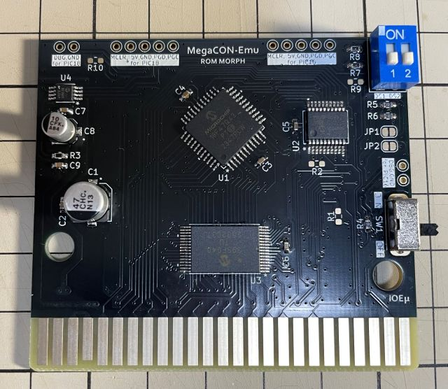
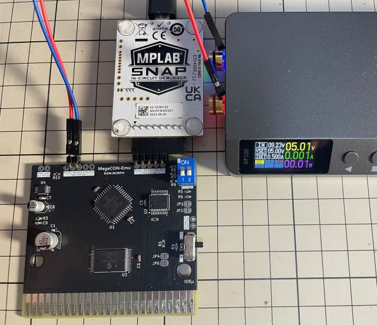
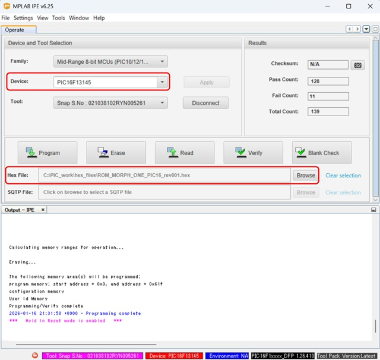

# IOEμ: ROM MORPH VAULT – Multi-Mapper Support with Flash-ROM and SRAM Backup Emulation

## 1. 概要

* ROM MORPH VAULT(以降、RM-VAULT)は、8-bit PICマイコンによるMulti-Mapper対応MegaROMコントローラエミュレーターを搭載したFlash ROMカートリッジです。
* MSX実機で使用できます。
* RM-VAULTは[ROM MORPH](/ROM_MORPH/readme_rom_morph.md)の派生モデルです。このため、Schematic、Gerberデータは[ROM MORPH](/ROM_MORPH/readme_rom_morph.md)と共通です。
* ROM MORPHシリーズは、2つの8-bit PICマイコン(Main:PIC18F, Sub:PIC16F)を使用し、SCC-Emu、Voice DAC、各種メモリバンク制御等の機能を実現しています。
* RM-VAULTは、これらの機能に加えて、ROM MORPHでは未対応の **SRAM BACK-UP Emu** 機能を搭載しました。
* この SRAM BACK-UP Emu 機能により、PAC、新10倍(Game Master2)、HYDLIDEⅡ(ASCII16K)、XANADU(ASCII8K)にも対応しました。
* 将来的に、ROM MORPHとRM-VAULTは統合する予定です。
* Flash-ROM容量は4Mbitですが、RM-VAULTでは、Max 2Mbit/bankの2-bank modeのみに対応します。
* 2-bank modeでは4MbitのFlash-ROMを2バンクに分け、Max 2MbitのROMを2つ書き込み可能で、Mapper-typeも個別に指定できます。
* 2Mbitを超えるROMを利用する場合は、Max 4MbitのSingla-bank modeに対応する[ROM MORPH](/ROM_MORPH/readme_rom_morph.md)をご利用ください。
* RM-VAULTの Mapper-Type は、PAC、KONAMI-SCC、KONAMI(非SCC)、ASCII8K、ASCII16K、NORMAL-ROMの6種類に対応しています。
* SRAM BACK-UP Emu 機能は、PAC、KONAMI(非SCC)、ASCII8K、ASCII16K の4種のMapper-Typeで使用できます。
* BACK-UPメモリには、PIC内蔵のNVM（不揮発性メモリ）を用いています。
* このため、BACK-UPメモリはROMの書き換えでは消えません。ROMを書き換えた場合も、再度ROMを書き戻せば、BACK-UPデータは復活します。
* また、Mapper-type毎に8KByte、計32KbyteのNVMが割り当てられるため、各MapperのBACK-UPデータは共存できます。
* NVMの書き換え可能回数は有限（後述）ですが、ROM MORPHシリーズのF/Wでは使用されない領域を使用しており、仮にNVMの寿命を超えてもROM MORPHとして使用できます。
* その代わりバックアップ電池も、SRAMも使用せずに、SRAM BACK-UP機能を実現しています。
* Mapper-Typeの切り替えは、専用のDOSコマンドで行い、その設定はRM-VAULTの不揮発性メモリ(PIC内蔵)に保存されます。
* Simplexシリーズの[SCC-Emu](/SCC-Emu_Simplex_12bit-DAC/readme_scc-emu_12.md)相当が搭載されており、KONAMI-SCC MapperではSCCサウンドの再生も可能です。
* また、Voice DAC機能も搭載しており、KONAMI(非SCC)、NORMAL Mapperでは一部ソフトで音声再生も可能です。
* 例えば、新世サイザー(Konami's Synthesizer)、牌の魔術師ではVoice DACによる発声が可能です。
* SCCレジスタ、BANKレジスタへのアクセスにはWaitが挿入されますが、Flash ROMへのアクセスにはRM-VAULTはWaitを挿入しません。
* このため、8-bit PICによるエミュレーションでもゲームプレイへの違和感は少なく抑えられていると思います。
* 入手性の良い現役の安価なPICマイコンを使用しており、その周辺回路も含めて、2026年現在でも入手可能な部品で設計しています。
* 4MbitのFlash ROMもDigikeyで入手できます（2026年2月時点）。

## 2. 外観



## 3. 使用方法

お手持ちのROMのバックアップデータや自作ROMデータを書き込むことで通常のMSX用のROMカートリッジと同様に使用出来ます。
貴重なレトロROMは直接使用せずに保管し、遊ぶ際にはRM-VAULTを使う、自作のソフトをROM化する等を想定しています。

使用例は[こちら](https://x.com/kickstate7/status/2017745468936343953)。※Ｘへのリンクです。

### (1) Flash-ROM書込み方法

専用のDOSコマンド[RMBURN.COM](tools/)を使用してRM-VAULTのFlash-ROMに任意データを書き込みます。書き込み時のROMデータのMapper-Typeは何であっても構いません。ROMデータはRAWデータとして書き込まれ(Patchは当てません)、Mapper-Typeは後述の別コマンドで設定します。前述の概要通り、RM-VAULTは、Max 2MbitのROMを2つまで書き込めます(2bank-mode)。2Mbitを超えるROMデータを書き込む場合は、本RM-VAULTではなく[ROM MORPH](/ROM_MORPH/readme_rom_morph.md)を利用ください。

以下、書き込み手順です。専用コマンドはDOS1でも使用できます。書き込み時間はデータ容量次第ですが、1Mbitでも数分掛かります。

※ RM-VAULTをはじめて使用する際は、Flash-ROMへの書き込みの前にPIC16、PIC18のfirmwareの書き込みを先に行う必要があります。「5. PICマイコン用Firmwareの書き込み方法」に従って、PICマイコンのfirmwareの書き込みを行って下さい。

1. MSX本体の電源をオフしてから、RM-VAULTを基本スロットの1または2に挿入してください。※ 書き込みツールは拡張スロットに対応していません。
2. RM-VAULT基板右端のスライドスイッチ(SW1)をオフにしてMSXを起動してください。SW1をオフにするとROMから起動しません。
3. DOS起動後、スライドスイッチ(SW1)を再度**オン**にしてください。SW1は基板端にあるため、操作しずらいと思いますが、なんとかお願いします。
4. ディップスイッチ(DS1)を書き込み対象のバンク(bank1 or bank2)に設定してください。(3)のスイッチ類を参照ください。
5. DOSプロンプトで、RMBURN <ファイル名> [S1|S2] を実行してください。Sオプションはスロット指定です。Sオプションを省略した場合はスロット1が選択されます。
6. 書き込み中は簡易プログレスとして「*」が4Kbyte毎に表示されます。
7. 書き込み完了後、完了メッセージが表示されます。
8. 書き込んだROMに合わせてMapper-Typeを設定して下さい。Mapper-Typeの設定は(2)を参照して下さい。

※ Mapper-Typeの設定を忘れるとROMは正常に起動しませんので、必ず(2)のMapper-Typeを設定してください。

書き込みコマンド：
```DOS
RMBURN <file> [S1|S2] [E]
```
* 本コマンドは、DOS1でも使用可能です。各パラメータに小文字も使用できます。
* Sオプション：RM-VAULTを挿した基本スロットを指定。指定なしの場合はスロット1となります。
* Eオプション：書込み前にFlash-ROM全体を消去します。Eオプション無しの場合は書き込み対象領域のみを部分消去（ページ消去）します。
* スロット1にRM-VAULTを挿している場合は、オプション無しで以下のように実行してください。通常、Eオプションは使用しません。

```DOS
RMBURN <file>
```

### (2) Mapper-Type設定方法

専用のDOSコマンド[VTMAP.COM](tools/)を使用してRM-VAULTにMapper-Typeを設定します。Mapper-Type設定コマンドはROM MORPH用とは異なります。RM-VAULT専用の「VTCOM」を使用してください。Mapper-Typeの設定値はRM-VAULTの不揮発性メモリ（ROMデータとは別の領域）に保存され、MSXの電源をオフしても消えません。

RM-VAULTは、Max 2Mbitの2-bank modeのみに対応しますが、2-bank modeでは4MbitのFlash-ROMを2バンクに分け、バンク毎にMapper-Typeを設定できます。2Mbitを超えるROMデータを書き込む場合は、本RM-VAULTではなく[ROM MORPH](/ROM_MORPH/readme_rom_morph.md)を利用ください。

以下、RM-VAULTの対応するMapper-Typeです。左の番号はRM-VAULTにMapper-Typeを設定する際に使用するMapper-Codeです。

|Mapper-Code|Mapper-Type|最大ROMサイズ / bank|備考
|--|--|--|--
|0|PAC|-|SRAM BACK-UP Emu対応。
|1|KONAMI SCC|2Mbit|SCC-Emu対応。
|2|KONAMI (非SCC)|1Mbit|SRAM BACK-UP Emu、及び Voice DAC対応。ROMサイズの制限は下記参照。
|3|ASCII8K|2Mbit|SRAM BACK-UP Emu対応。
|4|ASCII16K|2Mbit|SRAM BACK-UP Emu対応。
|5|NORMAL|32KByte|Voice DAC対応。

* 「PAC」の利用にはROMの書き込みは不要です。「PAC」を使用する場合は、SW1をオフにして、ROMによる起動を無効化してください。
* 「KONAMI (非SCC)」、「NORMAL」では対応するソフト（例：牌の魔術師、新世サイザー Konami's Synthesizer）であれば、Voice DAC機能により音声も再生できます。
* 「KONAMI (非SCC)」のSRAM BACK-UP Emu機能は、新10倍(Game Master2)に対応しています。
* 「KONAMI (非SCC)」は、SRAM対応のため、バンクレジスタの仕様により1MbitのROMのみの対応になります。
*  KONAMI (非SCC)  Mapperでは 2Mbit 以上のROMを書き込む場合は[ROM MORPH](/ROM_MORPH/readme_rom_morph.md)を使用下さい。
* 「ASCII8K」のSRAM BACK-UP Emu機能は、XANADUに対応しています。
* 「ASCII16K」のSRAM BACK-UP Emu機能は、HYDLIDEⅡに対応しています。
*  SRAM-BACKUP EmuのBACKUPデータ容量は、対応Mapper毎に8Kbyte、計32Kbyteです。

RM-VAULTのMapper-Typeは、VTMAPコマンドを上記のMapper-codeをパラメータ指定し実行することで設定できます。

Mapper Switchコマンド：
```DOS
VTMAP Mnn
```
* 本コマンドは、DOS1でも使用可能です。パラメータに小文字も使用できます。
* MパラメータでMapper-Typeを指定します。
* Mパラメータに続く「nn」は2桁の値です。下位の桁でBank1、上位の桁でBank2のMapper-Codeを指定します。
* Mapper-Typeを変更した後は、必ず、一度、MSX本体の電源をオフしてください。

設定例1： bank1: KONAMI SCC, bank2: PAC
```DOS
VTMAP M01
```
設定例2： bank1: KONAMI (非SCC), bank2: ASCII8K
```DOS
VTMAP M32
```

### (3) スイッチ類

* SW1 : 基板右端のスライドスイッチ。ROMの起動をON、OFF出来ます。
* SW2 : 基板右上の2回路のディップスイッチ。DS1 (左)は2-bank mode時のbank[1|2]指定に使用します。DS2 (右)は現時点で予約です。

ディップスイッチ(SW2)：
|SW#|OFF|ON|備考
|--|--|--|--
|DS1 (左)|Bank2|bank1| Flash-ROMのbankを指定します。
|DS2 (右)|-|-| 未使用（予約）

### (4) SCC互換音源としての利用

RM-VAULTの「KONAMI-SCC」Mapperは、SCC互換モードに対応していますが、IOEμの他のSCC-Emuシリーズとは異なり、SCCレジスタのリードには対応していません。このためMGSDRV等ではRM-VAULTを自動識別できませんが、手動でRM-VAULTのスロットを指定すればMGSDRVでも使用できることを確認しています。
RM-VAULTをSCC互換音源として使用する場合は、Mapper-Typeを「KONAMI-SCC」に設定、スライドスイッチ(SW1)をオフ、RM-VAULTのスロット番号を指定してMGSDRVを使用してください。

**ぱるぷ(@parupu_x_nagae)さんのゲームミュージック・SCCアレンジ作品がおススメです。**

[ぱるぷさんの作品集](https://parupu.hatenablog.com/archive/category/MSXplay)

## 4. 使用上の注意

### (1) SRAM-BAKUP Emuで利用している不揮発性メモリの書き換え回数

SRAM-BAKUP Emuは、SRAMではなくPIC内蔵NVM（不揮発性メモリ）を使用してBACKUPデータを保存します。このPIC内蔵NVMの書き換え可能回数は、「常温」環境下で1万回程度を想定していますが、あくまで期待値です。メーカー定格は、Ta:85℃において、Min 1000回です。一方でBACKUPデータの保存に使用するPIC内蔵NVMは、ROM MORPHシリーズのFirmwareでは使用されない領域を使用しており、仮にNVMの寿命を超えてもROM MORPHとして使用できます。また、このNVMのアクセスの際には、キャッシュメモリを用いており、書き込み回数を減らす工夫もしています。

このようにRM-VAULTでは余ったNVM領域を使わずに放置するのではなく積極的に使用しています。常温下で1万回を期待し、リスクよりも利便性を取っています。その代わりバックアップ電池も、SRAMも使用せずに SRAM-BACK UP機能を実現しており、さらに4つのMapper-Type「PAC、KONAMI、ASCII8K、ASCII16K」毎に8KByte、計32KbyteのBACKUPデータを保存できます。

以上の通り、RM-VAULTで保存されるBACKUPデータは消失リスクがありますので、自己責任でご利用ください。大切なプレイデータは、一般公開されているツール等を用いてバックアップされることをお勧めします。

### (2) SRAM-BAKUP EmuのBACK-UPデータの消去

BACKUPデータはROMデータの書き込みでは消えませんが、PICマイコン(PIC18)のFirmwareをUpdateすると消去されます。
PICマイコンのFirmwareをUpdateする際は、大切なプレイデータは、一般公開されているツール等を用いてバックアップしてください。

### (3) 動作確認済みのMSX本体

以下のMSXで起動することを確認しています。随時、確認していきます。

* FS-A1GT (turboR)
* HB-F1XDJ (MSX2+)
* CX5F (MSX)
* MeSX (MSX互換機)

※ MeSXには、PIC16/18 Firmware Rev.0.0.4以降で対応しています。

## 5. PICマイコン用Firmwareの書き込み方法

firmwareフォルダ内の**HEXファイル**は、PICマイコン用のFirmwareです。
PIC18F(U1)用とPIC16F(U2)用の2種類のfirmewareがあり、それぞれ別々に書き込む必要があります。
オンボードでのFirmware書き込み方法は以下を参考にしてください。

**Firmwareをオンボードで書き込む場合、必ず、MSX本体からRM-VAULTを取り外した状態で行ってください。MSX本体に挿入した状態ではFirmwareの書き込みは出来ません。MSX本体の故障の原因にもなります。また、Firmwareの書き込みを行うと、SRAM-BACKUP Emu機能で保存したBACK-UPデータは消去されます。大切なプレイデータは、一般公開されているツール等を用いてバックアップしてください。**

オンボード書き込みに必要なもの:

* [MPLAB IPE(書込みソフト)](https://www.microchip.com/en-us/tools-resources/production/mplab-integrated-programming-environment)

* [MPLAB SNAP(インサーキットデバッガ/プログラマ)](https://www.microchip.com/en-us/development-tool/pg164100)

* [スルーホール用テストワイヤ TP-200](https://akizukidenshi.com/catalog/g/g109830/)

* 5V出力の安定化電源

IPEソフトウェアは、マイクロチップ製マイコンの統合開発環境[MPLAB X IDE](https://www.microchip.com/en-us/tools-resources/develop/mplab-x-ide)をインストールすると一緒にインストールされます（IPEのみを選択インストール可能です）。
SNAPは、FWの書込みに使用します。
SNAPの代わりに[PICkit BASIC](https://www.microchip.com/en-us/development-tool/pg164110)等も使用できます。

SNAPとRM-VAULTの接続にスルーホール用テストワイヤ、又は2.54mmピッチのL型のピンヘッダ（半田付け）を使用します。
**テストワイヤを使用する場合は、ピン間がショートしないようにピン間を絶縁テープで保護することをお勧めします。**

基板にはSNAPと接続するための「2.54mmピッチで5個並んだスルーホール群」が、基板上端に2つあります。基板に向かって左がPIC18F（U1）書込み用、右がPIC16F（U2）書込み用です。書込みに順番はありません。どちらから書き込みを行っても問題はありません。
電源は書き込まない方のスルーホール群中の5VとGNDを使用して使って給電してください。以下の写真を参考にして下さい。写真の例ではL形のピンヘッダを使用しています。

* 信号名は基板上のシルクを参考にして下さい。スルーホールとSNAPの各信号の並びは同じですが、逆順に接続しないように注意ください。
* 安定化電源は、書き込まない方法のスルーホール群内の5VとGNDのスルーホールを使って接続し、5Vを給電してください。

**※ Firmware書込み時は絶対にRM-VAULTをMSX本体に接続しないで下さい。故障の原因になります。また、カードエッジ部を絶縁することをお勧めします（写真の例では絶縁はしていません）。**




PC（IPE）、SNAP、RM-VAULTを各ケーブルで接続後、firmwareフォルダ内のHEXファイルをIPEを使って書き込みます。
PIC18(U1)の書込みにはPIC18用のHEXファイル、PIC16(U2)の書込みにはPIC16用のHEXファイルを使用してください。

以下を参考に、DeviceとHEXファイルを選択下さい。DeviceはPIC18（U1）が「**PIC18F47Q43**」（Family: Advanced 8-bit MCUs）、PIC16（U2）が「**PIC16F13145**」（Family: Mid-Range 8-bit MCUs）です。

DeviceとHEXファイルを選択後、「Connect」をクリックするとIPEとRM-VAULTのPICマイコンがリンクします。その後に「Program」をクリックするとFWの書込みが行われます。




## 6. 基板の発注方法

基板の発注方法を例示しますが、利用者の責任において実施して下さい。[IOEμの免責事項](../readme.md)を参照下さい。

基板メーカーに[JLCPCB](https://jlcpcb.com/jp)を使用される場合は、gerberフォルダ内のZIPファイル（ガーバーファイル）をそのまま[アップロード](https://cart.jlcpcb.com/jp/quote?orderType=1&stencilLayer=2&stencilWidth=100&stencilLength=100)してください。

主な基板仕様は以下の通りです。

* 寸法：ガーバーファイル（ZIPファイル）のアップロードで自動入力されます。
* 層数：2層
* PCB厚さ：1.6mm
* 表面仕上げ：お好みで。ENIGは品質が良いですが、費用は高くなります。
* ビア処理：レジストカバー
* カードエッジコネクタ：YES (表面仕上げでENIGを使用しない場合もYESとしてください)
* 面取り：30°
* 端面スルーホール：No
* エッジメッキ：No

その他の項目はお好みで設定ください。


