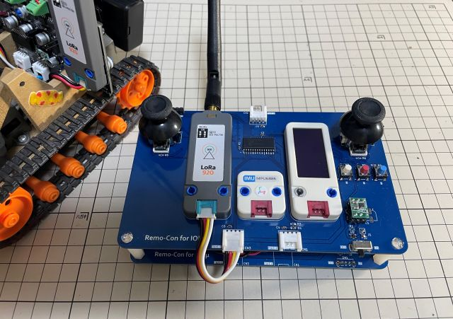

# Remo-Con Unit for IOEμ

Remo-Con Unitは、Motor-Driver UnitをMSXを使用せずに単独で制御可能なリモコンユニットです。また、IOEμ:Multiplexに搭載するGroveポートを経由してMSX用のコントローラとしても使用できます。

現時点で回路図とガーバーデータのみ公開しています。
マニュアル、ファームウェア等は準備中です。後日公開予定です。

ご利用にあたってはIOEμの免責事項をご確認ください。