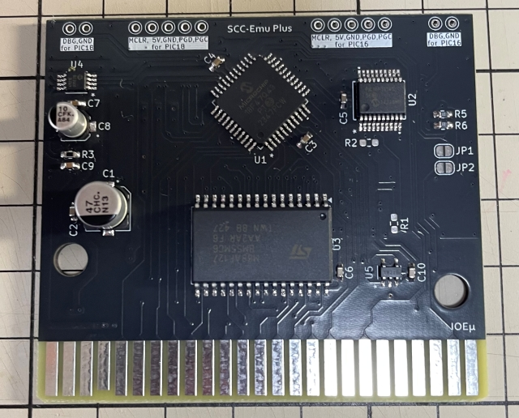
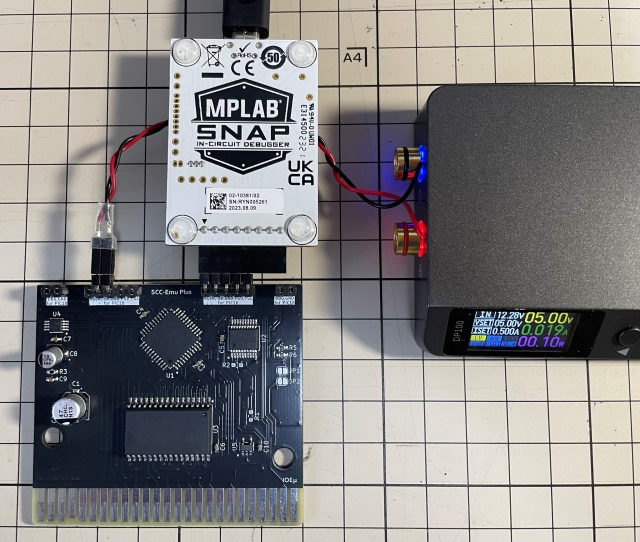
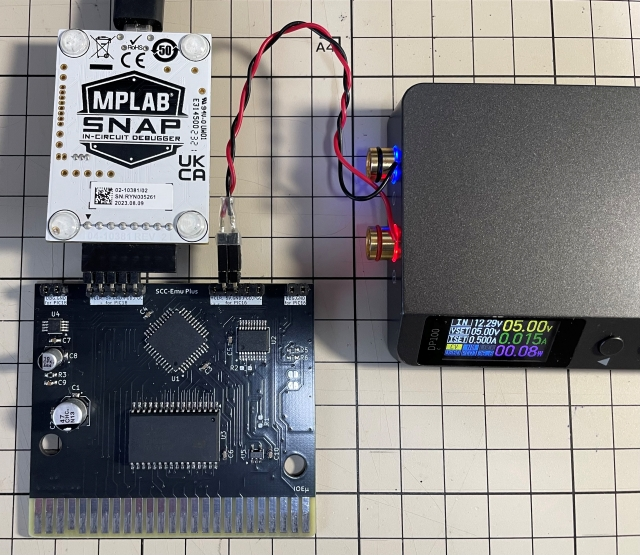
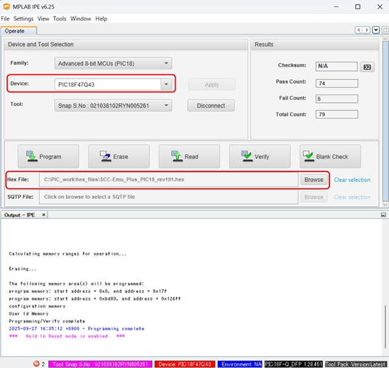
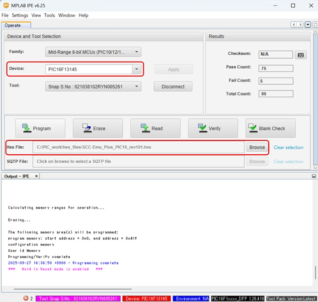

# IOEμ: SCC-Emu Plus with 1Mbit-SRAM 

## 1. 概要

* SCC-Emu Plus with 1Mbitは、8-bit PICマイコンによる「SOUND CARTRIDGE」のMSX実機用エミュレーターです。
* SCC機能は互換モード、固有モードの両モードに対応しています。
* メモリはオリジナルの2倍 1MbitのRAMを搭載しています。
* 2つの8-bit PICマイコン(Main:PIC18F, Sub:PIC16F)を使用し、SCC音源機能とSCCマッパー互換のバンク制御を実現しています。
* SNATCHER、及びKONAMIゲームコレクションVol.3のSCC版グラディウス、ツインビーの起動を確認しています。
* メモリ制御はSCCマッパーのメガロムと互換がありますので、1Mbit以下のROMデータのロードメモリとしても使用できます。但し、揮発性メモリです。
* 内部ロジック上は、2Mbit RAMにも対応可能な構成となっており、ニーズがあれば大容量品の製作も検討するかもしれません。
* SCCレジスタ、BANKレジスタへのアクセスにはWaitが挿入されますが、RAMへのアクセスにはSCC-Emu PlusはWaitを挿入しません。
* このため、8-bit PICによるエミュレーションでもゲームプレイへの違和感は少なく抑えられていると思います（ゼロではありません）。
* 入手性の良い現役の安価なPICマイコンを使用しており、その周辺回路も含めて、2025年現在でも入手可能な部品で設計しています。
* 1MbitのSRAMも秋月電子で安価に入手できます（2025年9月時点）。

## 2. 外観

## 3. 使用方法

### (1) SNATCHER等のSOUND CARTRIDGE対応ゲーム

**SCC-Emu Plus with 1Mbit基板**（以下、SCC-Emu Plus）をMSX本体の空きスロットに、SNATCHER、ゲームコレクション等のSOUND CARTRIDGE対応のGAME DISKをフロッピーディスクドライブに挿入し、MSX本体の電源をオンしてください。ゲームが起動します。

※ SNATCHERはDISK1の起動、オープニングの再生まで確認していますが、SDスナッチャーは動作未確認です（所有していません...）。ゲームコレクションはVol.3のグラディウスとツインビーで起動とSCCが鳴ることを確認しています。

### (2) SCC互換音源としての利用

SCC-Emu PlusはSCC互換モードにも対応しています。MGSDRV用プレーヤーでお好みのSCCの楽曲を再生ください。SCC-Emu Plusは、SCC互換音源として認識されますが、古いバージョンのMGSDRVをご使用の場合はスロット指定が必要な場合があるようです。その場合はSCC-Emuを挿入したスロット番号を指定してください。

**ぱるぷ(@parupu_x_nagae)さんのゲームミュージック・SCCアレンジ作品がおススメです。**

[ぱるぷさんの作品集](https://parupu.hatenablog.com/archive/category/MSXplay)

### (3) SCCマッパー対応ROMデータの実行

SOUND CARTRIDGEのメモリ制御は、SCCマッパーのメガロムと互換があります。
「Sound Cartridge ROM loader (SCROM Ver.1.2)」、「Sofarun」等を使用すると、SCC-Emu PlusのRAMに1MbitまでのROMデータをダウンロード、実行出来るようです。使用例は[こちら](https://x.com/kickstate7/status/1971856784978755724)。※Ｘへのリンクです。

## 4. 使用上の注意

### (1) 動作確認済みのMSX本体

以下のMSX、MSX互換機で起動することを確認しています。MeSX、OneChipBookで使用する場合は、F/W Rev. 1.0.2以降をお試し下さい（Rev. 1.0.1では起動しません）。但し、OneChipBookにおいてはソフトとの相性が確認されていますので、現時点でOneChipBookでの利用は推奨しません。

* FS-A1GT (turboR)
* HB-F1XDJ (MSX2+)
* 1chipMSX (MSX2相当) オリジナル版 ※FPGAのバージョンは出荷版
* CX5F (MSX1) 
* MeSX
* OneChipBook（OCM-PLD v3.9.2との組み合わせ）

### (2) MSX本体のリセット

SCC-Emu Plusは、MSX本体のリセット信号を使用していません。
そのため、SCC-Emu Plusが発音中にリセットすると、その時点で発声していた音が鳴り続けます。
リセットを使用せずに電源をオフしてください。

## 5. PICマイコン用Firmwareの書き込み方法

firmwareフォルダ内の**HEXファイル**は、PICマイコン用のFirmwareです。
PIC18F(U1)用とPIC16F(U2)用の2種類のfirmewareがあり、それぞれ別々に書き込む必要があります。
オンボードでのFirmware書き込み方法は以下を参考にしてください。

**Firmwareをオンボードで書き込む場合、必ず、MSX本体からSCC-Emu Plusを取り外した状態で行ってください。MSX本体に挿入した状態ではFirmwareの書き込みは出来ません。MSX本体の故障の原因にもなります。**

オンボード書き込みに必要なもの:

* [MPLAB IPE(書込みソフト)](https://www.microchip.com/en-us/tools-resources/production/mplab-integrated-programming-environment)

* [MPLAB SNAP(インサーキットデバッガ/プログラマ)](https://www.microchip.com/en-us/development-tool/pg164100)

* [スルーホール用テストワイヤ TP-200](https://akizukidenshi.com/catalog/g/g109830/)

* 5V出力の安定化電源

IPEソフトウェアは、マイクロチップ製マイコンの統合開発環境[MPLAB X IDE](https://www.microchip.com/en-us/tools-resources/develop/mplab-x-ide)をインストールすると一緒にインストールされます（IPEのみを選択インストール可能です）。
SNAPは、FWの書込みに使用します。
SNAPの代わりに[PICkit BASIC](https://www.microchip.com/en-us/development-tool/pg164110)等も使用できます。

SNAPとSCC-Emu Plusの接続にスルーホール用テストワイヤ、又は2.54mmピッチのL型のピンヘッダ（半田付け）を使用します。
**テストワイヤを使用する場合は、ピン間がショートしないようにピン間を絶縁テープで保護することをお勧めします。**

基板にはSNAPと接続するための「2.54mmピッチで5個並んだスルーホール群」が、基板上端に2つあります。基板に向かって左がPIC18F（U1）書込み用、右がPIC16F（U2）書込み用です。書き込みは最初にPIC16F(U2)から行ってください。その次にPIC18F（U1）の書込みを行ってください。
電源は書き込まない方のスルーホール群中の5VとGNDを使用して使って給電してください。以下の写真を参考にして下さい。写真の例ではL形のピンヘッダを使用しています。

* 信号名は基板上のシルクを参考にして下さい。スルーホールとSNAPの各信号の並びは同じですが、逆順に接続しないように注意ください。
* 安定化電源は、書き込まない方法のスルーホール群内の5VとGNDのスルーホールを使って接続し、5Vを給電してください。

**※ Fireware書込み時は絶対にSCC-Emu PlusをMSX本体に接続しないで下さい。故障の原因になります。また、カードエッジ部を絶縁することをお勧めします（写真の例では絶縁はしていません）。**

PC（IPE）、SNAP、SCC-Emu Plusを各ケーブルで接続後、firmwareフォルダ内のHEXファイルをIPEを使って書き込みます。
PIC18(U1)の書込みにはPIC18用のHEXファイル、PIC16(U2)の書込みにはPIC16用のHEXファイルを使用してください。

以下を参考に、DeviceとHEXファイルを選択下さい。DeviceはPIC18（U1）が「**PIC18F47Q43**」（Family: Advanced 8-bit MCUs）、PIC16（U2）が「**PIC16F13145**」（Family: Mid-Range 8-bit MCUs）です。

DeviceとHEXファイルを選択後、「Connect」をクリックするとIPEとSCC-Emu PlusのPICマイコンがリンクします。その後に「Program」をクリックするとFWの書込みが行われます。

## 6. 基板の発注方法

基板の発注方法を例示しますが、利用者の責任において実施して下さい。[IOEμの免責事項](../readme.md)を参照下さい。

基板メーカーに[JLCPCB](https://jlcpcb.com/jp)を使用される場合は、gerberフォルダ内のZIPファイル（ガーバーファイル）をそのまま[アップロード](https://cart.jlcpcb.com/jp/quote?orderType=1&stencilLayer=2&stencilWidth=100&stencilLength=100)してください。

主な基板仕様は以下の通りです。

* 寸法：ガーバーファイル（ZIPファイル）のアップロードで自動入力されます。
* 層数：2層
* PCB厚さ：1.6mm
* 表面仕上げ：お好みで。ENIGは品質が良いですが、費用は高くなります。
* ビア処理：レジストカバー
* カードエッジコネクタ：YES (表面仕上げでENIGを使用しない場合もYESとしてください)
* 面取り：30°
* 端面スルーホール：No
* エッジメッキ：No

その他の項目はお好みで設定ください。

