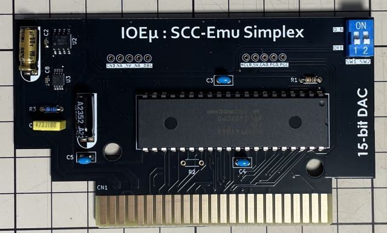
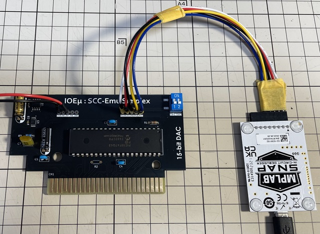
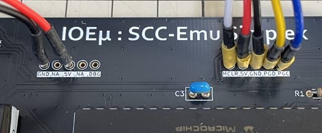
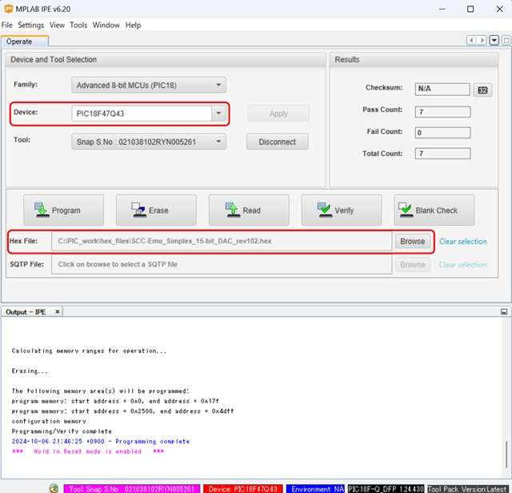

# IOEμ: SCC-Emu Simplex with 15-bit DAC

## 1. 概要

* SCC-Emu Simplex with 15-bit DACは、8-bit PICマイコンによるSCC音源エミュレーターです。
* MSX実機上でMGSDRV用のSCC互換音源として使用できます。
* サウンド波形の生成には、15-bit DACを使用しています(実際は16-bit DACの上位15bitsを使用)。
* このため、11-bit DACを使用するオリジナル品よりも理論上のダイナミックレンジが広いことも特徴の一つです。
* トーン生成は、PICマイコン搭載機能を活用し、5ch独立制御を実現しています。
* このため、PICの8-bit CPUの負荷に影響を受けず、安定したtoneを生成できます。
* PICの8-bit CPUは、MSXバスのエミュレーションと波形合成に使用しています。
* MSXのバスアクセスは、可変WAITサイクルを採用し、波形合成、DAC出力を優先する設計です。

## 2. 外観

## 3. 使用方法

MSX本体の電源をオフしてから、空きスロットに**SCC-Emu Simplex with 15-bit DAC基板**（以下、SCC-Emu）を挿入し、MGSDRV用プレーヤーでお好みのSCCの楽曲を再生ください。
SCC-Emuは、SCCとして認識されますが、古いバージョンのMGSDRVをご使用の場合はスロット指定が必要な場合があるようです。
その場合はSCC-Emuを挿入したスロット番号を指定してください。

**ぱるぷ(@parupu_x_nagae)さんのゲームミュージック・SCCアレンジ作品がおススメです。**

[ぱるぷさんの作品集](https://parupu.hatenablog.com/archive/category/MSXplay)

基板右上のディップスイッチ（青色）はブートモード設定用です。このスイッチは電源オフ時にのみ設定出来ます。
通電中にスイッチを変更しても機能設定は変更されません。通常は、全てオフで使用します。
なお、全てオフで使用する場合はディップスイッチを実装する必要はありません。

以下、ディップスイッチの機能です。

|SW#|OFF|ON|備考
|--|--|--|--
|SW1|Normal mode|SCC Register Write-Only mode| 通常OFFで使用。ONの場合、MGSDRVはSCC-Emuを認識出来ません。
|SW2|-|-| 15-bit DAC版では未使用。

## 4. 使用上の注意

### (1) MSX本体のリセット

SCC-Emuは、MSX本体のリセット信号を使用していません。
そのため、SCC-Emuが発音中にリセットすると、その時点で発声していた音が鳴り続けます。
この場合、電源をオフするか、再度、MGSDRVで再生すると正常状態に戻ります。

### (2) 対応ソフト

SCC-Emuは、SCC互換のためMGSDRV以外でも使用できる可能性ありますが、未検証です。未検証ですが、SofarunでもExternal SCCとして認識されるようです。

## 5. PICマイコン用Firmwareの書き込み方法

firmwareフォルダ内の**HEXファイル**は、PICマイコン用のFirmwareです。Firmwareをオンボードで書き込むことも可能です。

**但し、Firmwareをオンボードで書き込む場合、必ず、MSX本体からSCC-Emuを取り外した状態で行ってください。MSX本体に挿入した状態ではFirmwareの書き込みは出来ません。MSX本体の故障の原因にもなります。**

オンボード書き込みに必要なもの:

* [MPLAB IPE(書込みソフト)](https://www.microchip.com/en-us/tools-resources/production/mplab-integrated-programming-environment)

* [MPLAB SNAP(インサーキットデバッガ/プログラマ)](https://www.microchip.com/en-us/development-tool/pg164100)

* [スルーホール用テストワイヤ TP-200](https://akizukidenshi.com/catalog/g/g109830/)

* 5V出力の安定化電源

IPEソフトウェアは、マイクロチップ製マイコンの統合開発環境[MPLAB X IDE](https://www.microchip.com/en-us/tools-resources/develop/mplab-x-ide)をインストールすると一緒にインストールされます。
SNAPは、FWの書込みに使用します。

SNAPとSCC-Emuの接続にスルーホール用テストワイヤを使用します。
**テストワイヤ間がショートしないようにピン間を絶縁テープで保護することをお勧めします。**
テストワイヤ TP-200の代わりに2.54mmピッチのL型のピンヘッダ（半田付け）も使用できます。

* SNAPは、以下写真のように基板右側の5個並んだスルーホール群とテストワイヤを使って接続します。
* 信号名は基板上のシルクを参考にして下さい。スルーホールとSNAPの各信号の並びは同じですが、逆順に接続しないように注意ください。
* 安定化電源は、基板左側のスルーホール群の中の5VとGNDのスルーホールをテストワイヤを使って接続し、5Vを給電してください。

**※ Fireware書込み時は絶対にDCSG-EmuをMSX本体に接続しないで下さい。故障の原因になります。また、カードエッジ部を絶縁することをお勧めします（写真の例では絶縁はしていません）。**

PC（IPE）、SNAP、SCC-Emuを各ケーブルで接続後、firmwareフォルダ内のHEXファイルをIPEを使って書き込みます。
SCC-Emu Simplex with 15-bit DAC版には、必ず、**15-bit DAC**用のHEXファイルを使用してください。

以下を参考に、DeviceとHEXファイルを選択下さい。Deviceは「**PIC18F47Q43**」です。Familyは「Advanced 8-bit MCUs(PIC18)」です。

DeviceとHEXファイルを選択後、「Connect」をクリックするとIPEとSCC-Emu(PIC18マイコン)がリンクします。その後に「Program」をクリックするとFWの書込みが行われます。

## 6. 基板の発注方法

基板の発注方法を例示しますが、利用者の責任において実施して下さい。[IOEμの免責事項](../readme.md)を参照下さい。

基板メーカーに[JLCPCB](https://jlcpcb.com/jp)を使用される場合は、gerberフォルダ内のZIPファイル（ガーバーファイル）をそのまま[アップロード](https://cart.jlcpcb.com/jp/quote?orderType=1&stencilLayer=2&stencilWidth=100&stencilLength=100)してください。

主な基板仕様は以下の通りです。

* 寸法：ガーバーファイル（ZIPファイル）のアップロードで自動入力されます。
* 層数：2層
* PCB厚さ：1.6mm
* 表面仕上げ：お好みで。ENIGは品質が良いですが、費用は高くなります。
* ビア処理：レジストカバー
* カードエッジコネクタ：YES (表面仕上げでENIGを使用しない場合もYESとしてください)
* 30°端子取り：YES
* 端面スルーホール：No
* エッジメッキ：No

その他の項目はお好みで設定ください。
