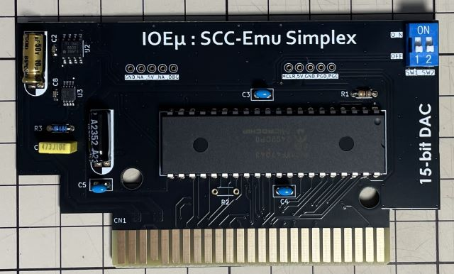
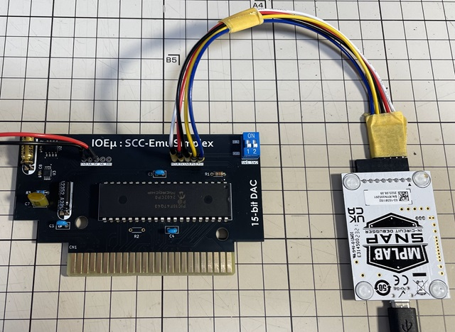
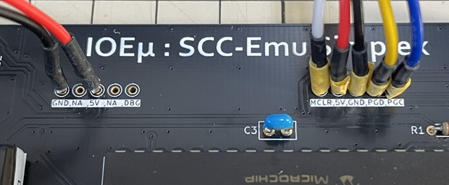
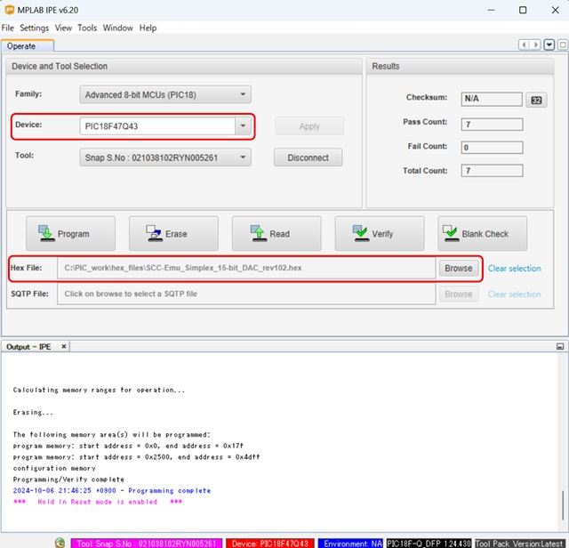

# IOEμ: SCC-Emu Simplex XR+ with 15-bit DAC

**An eXtended Simplex build featuring ROM/RAM emulation, SCC+, and 64KB MegaCON support on a single 8-bit PIC.**

## 1. 概要

* SCC-Emu Simplex XR+ with 15-bit DAC (以降、SCC-Emu XR+)は、[SCC-Emu Simplex with 15-bit DAC](/SCC-Emu_Simplex_15bit-DAC/readme_scc-emu_15.md)の派生モデルです。
* Schematic、GerberデータはSCC-Emu Simplexの15-bit DAC版と共通です。
* SCC-Emu XR+は、SCC-EmuのSCC互換モードに加えて、固有モードのSCC+、MegaCON、最大64KByteのROM/RAM-Emuを追加しました。
* ROM/RAM-Emuは、PIC内蔵のNVM（不揮発性メモリ）を活用しています。
* MegaCON機能により、最大64KByteのROM/RAMをSCC-Mapperのバンク切り替えで使用できます。
* マッパーは Normal-ROM（Max 32KByte）とSCC-Mapper(Max 64KByte)の2種類に対応しています。
* [ROM MORPH](/ROM_MORPH/readme_rom_morph.md)や[SCC-Emu Plus](/SCC-Emu_Plus_1Mbit/readme_scc-emu_plus.md)のようなDual PIC+外部メモリのHW構成とは異なり、SCC-Emu XR+では単一の8-bit PICにこれらの機能を詰め込みました。
* このため、ROM MORPH、SCC-Emu Plusではメモリアクセスは No wait でしたが、SCC-Emu XR+では、ROM/RAMのアクセスにそれなりのWaitが挿入されます。
* それでも ROM によってはゲームでもそれなりに動作するようです。
* ちょっとした用途、例えばスロットチェッカー、XBASIC（べーしっ君）などのツール類には、便利かと思います。
* ROMデータの書き込み・書き換えは専用のDOS(1)コマンドで簡単に出来ます。
* ROM-Emu機能は、Normal-ROM のマッパーモードで最速で動作しますので、おススメです。
* 一方、SCC-Mapper は Normal-ROM よりもBus-Waitサイクルが多少多く挿入されますが、ROM/RAMをアクセスしながら同時にSCC/SCC+を使用できます。
* また、SCC/SCC+機能はMGSDRV、VGMplayer等のMusicPlayer/Driverで認識されますので、SCC音源としても使用できます。
* RAM-Emu機能は、PIC内蔵のNVMを活用しているため、基本的にオマケ機能になります。常用は避けてください。NVMの書き換え可能回数は有限（後述）です。
* SCC-Emu XR+ は、**「1個の8-bit PICでどこまで出来るか？」にチャレンジしたものです**。その点、ご理解頂ければ嬉しいです。

## 2. 外観



## 3. 使用方法

### (1) 機能切り替え：DIPスイッチの設定方法

SCC-Emu XR+の動作モードは、DIPスイッチにより選択します。DIPスイッチの設定は、**電源オフ**時のみ変更できます。リセットでは動作モードは切り替わりませんので、設定変更は必ず、MSX本体の電源をオフしてから行って下さい。

以下、DIPスイッチの各SWの機能割り当てです。

|SW#|機能|SW ON|SW OFF|詳細
|--|--|--|--|--
|SW1|ROM/RAM-Emu|有効|無効|ROMへのデータを書き込み、及びSCC/SCC+音源としてMGSDRV、VGMplayerを利用する場合は、ROM/RAM-Emuは無効に設定して下さい。
|SW2|Mapper Type|Normal-ROM (Max 32KByte)|SCC-Mapper (Max 64KByte)|SCC-Mapper設定時にはROM/RAM-Emu動作中にもSCC/SCC+を使用できます。一方で Normal-ROMではSCC/SCC+は使用できませんが、Bus-Waitが少なくなりますのでROM Emuとして利用するならおススメです。Mapper-TypeはROM書き込み前に設定してください。また、各種MusicPlayerでSCC/SCC+音源として利用する場合もSCC-Mapperに設定してください。

以下、設定例です。
|設定例|SW1|SW2|備考
|--|--|--|--
|MusicPlayerでSCC/SCC+音源として利用する場合|OFF|OFF|MGSDRV、VGMplayer等のMusicPlayerでSCC/SCC+音源として認識されます
|SCC-MapperのROMデータを書き込む場合|OFF|OFF|専用のDOSコマンドを使ってROMデータをPIC内蔵NVMに書き込みます（Mapper-Type: SCC-Mapper）
|Normal-ROMのROMデータを書き込む場合|OFF|ON|専用のDOSコマンドを使ってROMデータをPIC内蔵NVMに書き込みます（Mapper-Type: Normal-ROM）
|SCC-MapperのROMでMSXをブートする場合|ON|OFF|PIC内蔵NVMに書き込まれたROMでMSXを起動します（Mapper-Type: SCC-Mapper）
|Normal-ROMのROMでMSXをブートする場合|ON|ON|PIC内蔵NVMに書き込まれたROMでMSXを起動します（Mapper-Type: Normal-ROM）

※ ROMデータの書き込みは、後述の専用DOS(1)コマンドを使用します。

### (2) SCC/SCC+音源

Mapper-Type: SCC-MapperのROM/RAM-EmuでSCC/SCC+音源を使用できる他、MGSDRV、VGMplayer等のMusicPlayerでSCC/SCC+音源としても利用できます。

MusicPlayerでSCC/SCC+音源として利用する場合はDIPスイッチの設定は、SW1、SW2ともにオフとして下さい。この設定で各PlayerはSCC-Emu XR+をSCC/SCC+音源として認識できるようになります。自動認識されない場合は各Player、Dirver側でスロット指定を試してみてください。

**ぱるぷ(@parupu_x_nagae)さんのゲームミュージック・SCCアレンジ作品がおススメです。**

[ぱるぷさんの作品集](https://parupu.hatenablog.com/archive/category/MSXplay)

### (3) ROM-Emu

2種類のMapper-Type: Normal-ROM, SCC-Mapper に対応します。専用のDOSコマンド[XRBURN.COM](tools/)を使用してPIC内蔵NVMに任意データを書き込みます。

以下、書き込み手順です。専用コマンドはDOS1でも使用できます。尚、後述のRAM-Emu機能を使用するとROMデータは上書きされますので、ご留意ください。

※ SCC-Emu XR+ をはじめて使用する際は、ROMデータの書き込みの前にPIC18のfirmwareの書き込みを先に行う必要があります。「5. PICマイコン用Firmwareの書き込み方法」に従って、PICマイコンのfirmwareの書き込みを行って下さい。

1. MSX本体の電源をオフしてからSCC-Emu XR+を基本スロットの1または2に挿入してください。※ 書き込みツールは拡張スロットに対応していません。
2. DIPスイッチのSW1をOFF(ROM/RAM-Emu無効)、SW2でMapper-Typeを設定してからMSXの電源をオンし、DOSを起動してください。
3. DOSプロンプトで、XRBURN <ファイル名> [S1|S2] を実行してください。Sオプションはスロット指定です。Sオプションを省略した場合はスロット1が選択されます。
4. 書き込み中は簡易プログレスとして「*」が8Kbyte毎に表示されます。
5. 書き込み完了後、完了メッセージが表示されますので、一度、電源をオフしてください。※リセットではなく電源をオフしてください。
6. DIPスイッチのSW1をON(ROM/RAM-Emu有効)にして、MSXの電源をオンすると書き込んだROMで起動します。

書き込みコマンド：
```DOS
XRBURN <file> [S1|S2]
```
* 本コマンドは、DOS1でも使用可能です。各パラメータに小文字も使用できます。
* Sオプション：SCC-Emu XR+を挿した基本スロットを指定します。指定なしの場合はスロット1となります。
* スロット1にSCC-Emu XR+を挿している場合は、オプション無しで以下のように実行してください。

```DOS
XRBURN <file>
```

### (4) RAM-Emu

まず最初に、RAM-Emu機能は実験的な「オマケ」です。常用は避けてください。常用には、[SCC-Emu Plus](/SCC-Emu_Plus_1Mbit/readme_scc-emu_plus.md)がおススメです！

RAM-Emu機能はPIC内蔵NVMを用いてRAMをエミュレートしていますが、NVMには書き込み回数に上限があります(後述の使用上の注意を参照下さい)。

RAM-Emu機能は、DIPスイッチのSW1がON(ROM/RAM-Emu有効)、SW2がOFF(SCC-Mapper)で、且つ、有効なROMデータが書き込まれていない場合（ROMで起動できない場合）に使用できます。仕様的には、コナミのSNATHCER用のSOUND CARTRIDGEと互換があり、コナミのゲームコレクションのSOUND CARTRIDGE対応ゲームの一部を起動できます(例：Vol.3のツインビー等)。

但し、RAMとしての書き込み速度が遅いため、ゲーム中に頻繁にRAMを書き換えるSNATHCERやゲームコレクション Vol.3のNEMESISでは使用できません。

ゲームコレクション Vol.3のツインビーのように起動時にRAMに1度だけ一括書込みを行うもの（その後、書き込みは行わないもの＝ゲーム中にFDDへのアクセスがないもの）は起動する可能性が高いですが、Bus-Waitの影響は出ますので、BGMを楽しめる程度と思ってください。

## 4. 使用上の注意

### (1) ROM/RAM-Emu機能で利用している不揮発性メモリの書き換え回数

SCC-Emu XR+のROM/RAM-Emu機能は、PIC内蔵NVM（不揮発性メモリ）を使用しています。このPIC内蔵NVMの書き換え可能回数は、「常温」環境下で1万回程度を想定していますが、あくまで期待値です。メーカー定格は、Ta:85℃において、Min 1000回です。このNVMのアクセスの際にはキャッシュメモリを用いており、書き込み回数を減らす工夫もしていますが、特にRAM-Emu機能を多用するとすぐに寿命に達することが予想されます。RAM-Emu機能はオマケ機能ですので常用は避けてください。

### (2) MSX本体のリセット

SCC-Emu Simplex XR+は、MSX本体のリセット信号を使用していません。そのため、DIPスイッチで動作モードを切り替える際はリセットではなく、必ず電源をオフしてください。また、SCC音源機能が発音中にリセットすると、その時点で発声していた音が鳴り続けますが、故障ではありませんので冷静に電源をオフしてください。

### (3) 動作確認済みのMSX本体

現時点で以下のMSXで起動することを確認しています。

* FS-A1GT (turboR)
* HB-F1XDJ (MSX2+)
* CX5F (MSX)

## 5. PICマイコン用Firmwareの書き込み方法

firmwareフォルダ内の**HEXファイル**は、PICマイコン用のFirmwareです。Firmwareをオンボードで書き込むことも可能です。

**但し、Firmwareをオンボードで書き込む場合、必ず、MSX本体からSCC-Emu XR+を取り外した状態で行ってください。MSX本体に挿入した状態ではFirmwareの書き込みは出来ません。MSX本体の故障の原因にもなります。**

オンボード書き込みに必要なもの:

* [MPLAB IPE(書込みソフト)](https://www.microchip.com/en-us/tools-resources/production/mplab-integrated-programming-environment)

* [MPLAB SNAP(インサーキットデバッガ/プログラマ)](https://www.microchip.com/en-us/development-tool/pg164100)

* [スルーホール用テストワイヤ TP-200](https://akizukidenshi.com/catalog/g/g109830/)

* 5V出力の安定化電源

IPEソフトウェアは、マイクロチップ製マイコンの統合開発環境[MPLAB X IDE](https://www.microchip.com/en-us/tools-resources/develop/mplab-x-ide)をインストールすると一緒にインストールされます。
SNAPは、FWの書込みに使用します。
SNAPの代わりに[PICkit BASIC](https://www.microchip.com/en-us/development-tool/pg164110)等も使用できます。

SNAPとSCC-Emu XR+の接続にスルーホール用テストワイヤを使用します。
**テストワイヤ間がショートしないようにピン間を絶縁テープで保護することをお勧めします。**
テストワイヤ TP-200の代わりに2.54mmピッチのL型のピンヘッダ（半田付け）も使用できます。

* SNAPは、以下写真のように基板右側の5個並んだスルーホール群とテストワイヤを使って接続します。
* 信号名は基板上のシルクを参考にして下さい。スルーホールとSNAPの各信号の並びは同じですが、逆順に接続しないように注意ください。
* 安定化電源は、基板左側のスルーホール群の中の5VとGNDのスルーホールをテストワイヤを使って接続し、5Vを給電してください。

**※ Fireware書込み時は絶対にSCC-Emu XR+をMSX本体に接続しないで下さい。故障の原因になります。また、カードエッジ部を絶縁することをお勧めします（写真の例では絶縁はしていません）。**





PC（IPE）、SNAP、SCC-Emu XR+を各ケーブルで接続後、firmwareフォルダ内のHEXファイルをIPEを使って書き込みます。
SCC-Emu XR+ with 15-bit DAC版には、必ず、**15-bit DAC**用のHEXファイルを使用してください。

以下を参考に、DeviceとHEXファイルを選択下さい。Deviceは「**PIC18F47Q43**」です。Familyは「Advanced 8-bit MCUs(PIC18)」です。

DeviceとHEXファイルを選択後、「Connect」をクリックするとIPEとSCC-Emu XR+(PIC18マイコン)がリンクします。その後に「Program」をクリックするとFWの書込みが行われます。



## 6. 基板の発注方法

基板の発注方法を例示しますが、利用者の責任において実施して下さい。[IOEμの免責事項](../readme.md)を参照下さい。

基板メーカーに[JLCPCB](https://jlcpcb.com/jp)を使用される場合は、gerberフォルダ内のZIPファイル（ガーバーファイル）をそのまま[アップロード](https://cart.jlcpcb.com/jp/quote?orderType=1&stencilLayer=2&stencilWidth=100&stencilLength=100)してください。

主な基板仕様は以下の通りです。

* 寸法：ガーバーファイル（ZIPファイル）のアップロードで自動入力されます。
* 層数：2層
* PCB厚さ：1.6mm
* 表面仕上げ：お好みで。ENIGは品質が良いですが、費用は高くなります。
* ビア処理：レジストカバー
* カードエッジコネクタ：YES (表面仕上げでENIGを使用しない場合もYESとしてください)
* 30°端子取り：YES
* 端面スルーホール：No
* エッジメッキ：No

その他の項目はお好みで設定ください。

## 7. 謝意

[西さんにMSX0 Stack/CARDを頂きました。](https://x.com/kickstate7/status/1834193174392414321)
ありがとうございました。
