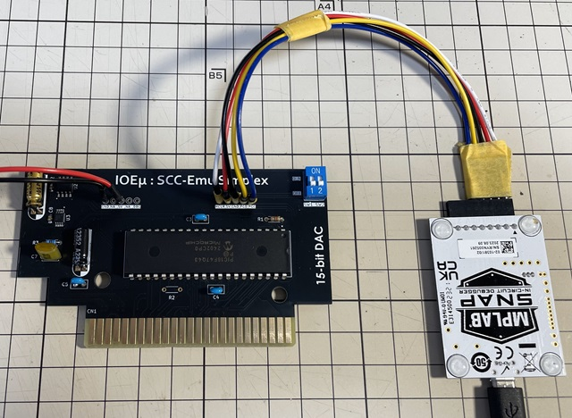

# IOEμ: SCC-PAC Emu with 12-bit DAC

※　FWにバグがあるため、FWの公開を停止しています。

## 1. 概要

* SCC-PAC Emu with 12-bit DAC (以降、SCC-PAC Emu)は、[SCC-Emu Simplex with 12-bit DAC](/SCC-Emu_Simplex_12bit-DAC/readme_scc-emu_12.md)の派生モデルです。
* Schematic、GerberデータはSCC-Emu Simplexの12-bit DAC版と共通です。
* SCC-PAC Emuは、SCC-EmuにPAC機能を追加しました。
* PAC機能は、[ROM MORPH VAULT](/ROM_MORPH_VAULT/readme_rom_morph_vault.md)と同じSRAM BACK-UP Emu機能を使って実現しています。
* PIC内蔵のNVM（不揮発メモリ）を使っているため、電池、SRAMは不要です。
* バックアップメモリの容量は、8KByte x4bankのTotal 32KByteでオリジナルの**4倍 (32ブロック)**です。
* ディップスイッチで4bankを切り替えて使用できます。PAC 4個分です！
* PAC対応ゲームでは使用するブロック番号が重なっていることもありますが、SCC-PAC Emuなら大丈夫です。
* NVMの書き換え可能回数は有限（後述）ですが、SCC-EmuシリーズのF/Wでは使用されない領域を使用しており、仮にNVMの寿命を超え
てもSCC-Emu Simplex相当として使用できます。
* SCC-Emuに関しては、SCC-Emu Simplexと基本的に同じですので、SCC-Emu Simplexの[Readme](/SCC-Emu_Simplex_12bit-DAC/readme_scc-emu_12.md)を参照してください。
* 12-bit DAC版は、部品に入手性の良いDIPチップを採用しており、安価で組み立ても容易です。(秋月さんで部品は揃います)

## 2. 外観

## 3. 使用方法

### (1) SCC互換音源

SCC-PAC EmuのSCC互換音源は、基本的にSCC-Emu Simplexと同じですので、SCC-Emu Simplex with 12-bit DACの[Readme](/SCC-Emu_Simplex_12bit-DAC/readme_scc-emu_12.md)を参照してください。
但し、ディップスイッチに関しては機能を変更しており、SCC-PAC EmuではPACのバンク切り替え（後述）に割り当てています。
※ SimplexにあったSCC-Emuの動作モード切替はSCC-PAC Emuではありません。負荷に応じて自動で調整されます。

**ぱるぷ(@parupu_x_nagae)さんのゲームミュージック・SCCアレンジ作品がおススメです。**

[ぱるぷさんの作品集](https://parupu.hatenablog.com/archive/category/MSXplay)

### (2) PAC機能

SCC-PAC EmuのPAC機能の使用方法は、オリジナルのPACと同様です。PAC対応ゲームでは、SCC-PAC EmuはPACとして認識されます。

バックアップメモリ容量は、オリジナルの4倍の32KByte（32ブロック）です。この32KByteを4領域（4バンク）に分けて使用でき、基板右上のディップスイッチ（青色）でバンクを指定できます。1バンクがPAC1個分の8ブロックです。

4つのバンクはディップスイッチで以下のように切り替わります。**このディップスイッチは電源オフ時にのみ設定出来ます（バンク切り替えはゲーム中は出来ません）。**

|SW1|SW2|バンク番号|ブロック数
|--|--|--|--
|OFF|OFF|Bank 0|8 blocks
|ON|OFF|Bank 1|8 blocks
|OFF|ON|Bank 2|8 blocks
|ON|ON|Bank 3|8 blocks

## 4. 使用上の注意

### (1) PAC機能で利用している不揮発性メモリの書き換え回数

SCC-PAC EmuのPAC機能は、SRAMではなくPIC内蔵NVM（不揮発性メモリ）を使用してBACKUPデータを保存します。このPIC内蔵NVMの書き換え可能回数は、「常温」環境下で1万回程度を想定していますが、あくまで期待値です。メーカー定格は、Ta:85℃において、Min 1000回です。一方でBACKUPデータの保存に使用するPIC内蔵NVMは、SCC-Emu SimplexシリーズのFirmwareでは使用されない領域を使用しており、仮にNVMの寿命を超えてもSCC-Emu Simplexとして使用できます。また、このNVMのアクセスの際には、キャッシュメモリを用いており、書き込み回数を減らす工夫もしています。

SCC-PAC Emu では余ったNVM領域を使わずに放置するのではなく積極的に使用しています。常温下で1万回を期待し、リスクよりも利便性を取っています。その代わりバックアップ電池も、SRAMも使用せずに SRAM-BACK UP機能を実現しており、さらにオリジナルの4倍のバックアップメモリ容量に対応しています。

以上の通り、PAC-Emuで保存されるBACKUPデータは消失リスクがありますので、自己責任でご利用ください。大切なプレイデータは、一般公開されているツール等を用いてバックアップされることをお勧めします。

### (2) PAC機能のBACK-UPデータの消去

SCC-PAC EmuのPAC機能のバックアップメモリは、PICマイコン(PIC18)のFirmwareをUpdateすると消去されます。
PICマイコンのFirmwareをUpdateする際は、大切なプレイデータは、一般公開されているツール等を用いてバックアップしてください。

### (3) SCC-Emu対応ソフト

SCC-PAC EmuのSCC互換音源は、SCC互換のためMGSDRV以外でも使用できる可能性ありますが、MGSDR以外での利用は未検証です。SofarunでもExternal SCCとして認識されるようです。また、SCCをPCMとして使用する応用例があるようですが、PCMでの利用は想定しておらず、現時点では対応していません。

### (4) MSX本体のリセット

SCC-PAC Emuは、MSX本体のリセット信号を使用していません。
そのため、SCC互換音源機能が発音中にリセットすると、その時点で発声していた音が鳴り続けます。
この場合、電源をオフするか、再度、MGSDRVで再生すると正常状態に戻ります。

## 5. PICマイコン用Firmwareの書き込み方法

firmwareフォルダ内の**HEXファイル**は、PICマイコン用のFirmwareです。Firmwareをオンボードで書き込むことも可能です。

**但し、Firmwareをオンボードで書き込む場合、必ず、MSX本体からSCC-PAC Emuを取り外した状態で行ってください。MSX本体に挿入した状態ではFirmwareの書き込みは出来ません。MSX本体の故障の原因にもなります。**

オンボード書き込みに必要なもの:

* [MPLAB IPE(書込みソフト)](https://www.microchip.com/en-us/tools-resources/production/mplab-integrated-programming-environment)

* [MPLAB SNAP(インサーキットデバッガ/プログラマ)](https://www.microchip.com/en-us/development-tool/pg164100)

* [スルーホール用テストワイヤ TP-200](https://akizukidenshi.com/catalog/g/g109830/)

* 5V出力の安定化電源

IPEソフトウェアは、マイクロチップ製マイコンの統合開発環境[MPLAB X IDE](https://www.microchip.com/en-us/tools-resources/develop/mplab-x-ide)をインストールすると一緒にインストールされます。
SNAPは、FWの書込みに使用します。
SNAPの代わりに[PICkit BASIC](https://www.microchip.com/en-us/development-tool/pg164110)等も使用できます。

SNAPとSCC-PAC Emuの接続にスルーホール用テストワイヤを使用します。
**テストワイヤ間がショートしないようにピン間を絶縁テープで保護することをお勧めします。**
テストワイヤ TP-200の代わりに2.54mmピッチのL型のピンヘッダ（半田付け）も使用できます。

* SNAPは、以下写真のように基板右側の5個並んだスルーホール群とテストワイヤを使って接続します。
※ 写真の基板は15-bit DAC版ですが、スルーホールの配置は12-bit DAC版も同じです。
* 信号名は基板上のシルクを参考にして下さい。スルーホールとSNAPの各信号の並びは同じですが、逆順に接続しないように注意ください。
* 安定化電源は、基板左側のスルーホール群の中の5VとGNDのスルーホールをテストワイヤを使って接続し、5Vを給電してください。

**※ Fireware書込み時は絶対にSCC-PAC EmuをMSX本体に接続しないで下さい。故障の原因になります。また、カードエッジ部を絶縁することをお勧めします（写真の例では絶縁はしていません）。**

PC（IPE）、SNAP、SCC-PAC Emuを各ケーブルで接続後、firmwareフォルダ内のHEXファイルをIPEを使って書き込みます。
SCC-PAC Emu with 12-bit DAC版には、必ず、**12-bit DAC**用のHEXファイルを使用してください。

以下を参考に、DeviceとHEXファイルを選択下さい。Deviceは「**PIC18F47Q43**」です。Familyは「Advanced 8-bit MCUs(PIC18)」です。

DeviceとHEXファイルを選択後、「Connect」をクリックするとIPEとSCC-PAC Emu(PIC18マイコン)がリンクします。その後に「Program」をクリックするとFWの書込みが行われます。

## 6. 基板の発注方法

基板の発注方法を例示しますが、利用者の責任において実施して下さい。[IOEμの免責事項](../readme.md)を参照下さい。

基板メーカーに[JLCPCB](https://jlcpcb.com/jp)を使用される場合は、gerberフォルダ内のZIPファイル（ガーバーファイル）をそのまま[アップロード](https://cart.jlcpcb.com/jp/quote?orderType=1&stencilLayer=2&stencilWidth=100&stencilLength=100)してください。

主な基板仕様は以下の通りです。

* 寸法：ガーバーファイル（ZIPファイル）のアップロードで自動入力されます。
* 層数：2層
* PCB厚さ：1.6mm
* 表面仕上げ：お好みで。ENIGは品質が良いですが、費用は高くなります。
* ビア処理：レジストカバー
* カードエッジコネクタ：YES (表面仕上げでENIGを使用しない場合もYESとしてください)
* 30°端子取り：YES
* 端面スルーホール：No
* エッジメッキ：No

その他の項目はお好みで設定ください。

## 7. 謝意

[西さんにMSX0 Stack/CARDを頂きました。](https://x.com/kickstate7/status/1834193174392414321)
ありがとうございました。

