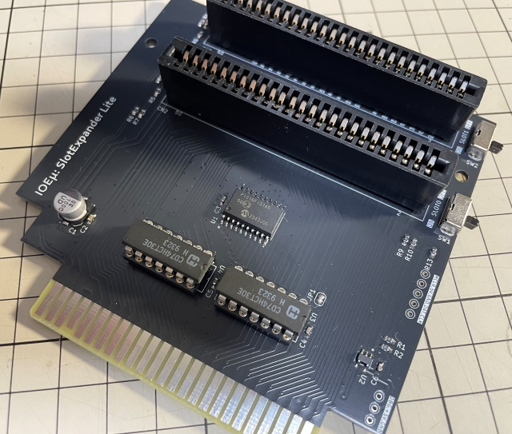
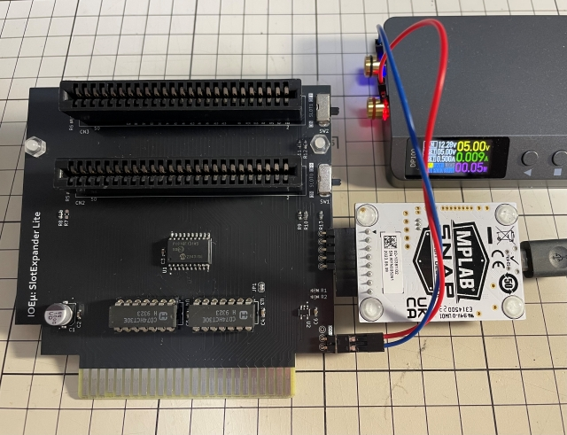
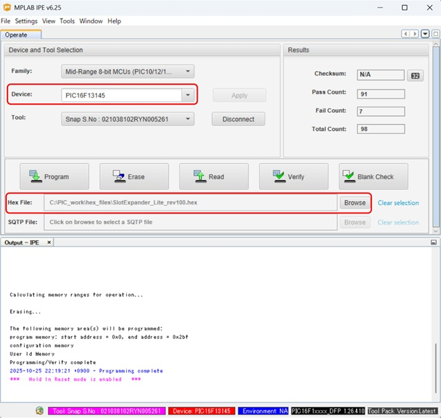

# IOEμ: SlotExpander Lite 

## 1. 概要

* IOEμ: SlotExpander Liteは、8-bit PICマイコン(PIC16F13145)で制御するMSX実機用の拡張スロットです。
* 8-bit PICマイコンを用いることで通常のロジックICで構成するよりも部品点数を削減しています。
* MSX本体背面スロットに接続して使用することを想定しています。
* MSX接続時の奥行を短くすることを優先し、スロット数は 2slotsとしています（内部ロジック的には4slotsにも対応しています）。
* 各スロットにはイネーブルスイッチを搭載しており、MSX本体起動時にカートリッジを無効化することが出来ます。
* 各スロットのサウンド出力をMIXする簡易Mixer回路（Passive型）も搭載しています。
* 但し、Passive型の簡易Mixer回路のため、MSX本体SOUNDINの入力ZによってはPSGとの音量バランスに影響を与える可能性があります。
* そのため、SOUND出力をSlot0に固定するJumper（半田タイプ）も搭載しています。
* 入手性の良い現役の安価なPICマイコンを使用しており、その周辺回路も含めて、2025年現在でも入手可能な部品で設計しています。

## 2. 外観

## 3. 使用方法

基本的な使い方は一般的なMSX用の拡張スロットと同じです。MSX本体の電源をオフにしてからスロットにカートリッジを挿入し、電源をオンしてください。

## 4. 使用上の注意

### (1) 動作確認済みのMSX本体、及びカートリッジ

以下のMSX、カートリッジ等で起動することを確認しています。**OneChipBook等のMSX互換機はサポートしません（動作しません）。**

＜本体＞
* FS-A1GT (turboR)
* HB-F1XDJ (MSX2+)
* CX5F (MSX1) 

＜カートリッジ＞
* ゲームROM：F1-SPIRIT
* 拡張RAM：うっかりくん（4MB拡張メモリ）
* FDD：ROOKIE DRIVE + USB-FDD
* FM音源：FM-PAC互換カートリッジ
* IOEμ：SCC-Emu Plus（SOUND CARTRIGE Emu）
* MSXπ：ロムの嵐、SPC700

### (2) スロットイネーブルスイッチ

各スロットにはイネーブルスイッチが付いています。Slot0用がSW1、Slot1用がSW2です。一時的にゲームROM等のカートリッジを起動したくない場合にスイッチをオフすると、そのカートリッジからのブートを無効にできます。但し、IOポート系は無効にできません。

### (3) SOUND Mixer回路

概要の通り、Sound Mixer回路はPassive型の簡易回路です。MSX本体のSOUNDINの入力Zの影響を受けます。MSX本体によってはMSX本体内蔵のPSG音源と拡張スロットの音源の音量バランスが崩れる可能性があります。その場合は、基板裏面のJP2をショート（半田）すると、Slot0のSOUND出力のみをMSX本体のSOUND入力に直結出来ますので、Slot0のみに音源カートリッジを挿入してください。

SCC音源（SCC-Emu Plus）とFM音源（FM-PAC互換カートリッジ）の同時使用例は[こちら](https://x.com/kickstate7/status/1981962642232315914)。※Ｘへのリンクです。

### (4) MSX本体のリセット

SlotExpander Liteは、DefaultではMSX本体のリセット信号を使用していません。MSX本体のリセット信号（リセットボタン含む）をSlotExpander Liteを初期化に使用したい場合は基板表面のJP1をショート（半田）して下さい。

## 5. PICマイコン用Firmwareの書き込み方法

firmwareフォルダ内の**HEXファイル**は、PICマイコン用のFirmwareです。
オンボードでのFirmware書き込み方法は以下を参考にしてください。

**Firmwareをオンボードで書き込む場合、必ず、MSX本体からSlotExpander Liteを取り外し、SlotExpander Liteのスロットにも何も挿さない状態で行ってください。MSX本体に挿入した状態ではFirmwareの書き込みは出来ません。MSX本体の故障の原因にもなります。**

オンボード書き込みに必要なもの:

* [MPLAB IPE(書込みソフト)](https://www.microchip.com/en-us/tools-resources/production/mplab-integrated-programming-environment)

* [MPLAB SNAP(インサーキットデバッガ/プログラマ)](https://www.microchip.com/en-us/development-tool/pg164100)

* [スルーホール用テストワイヤ TP-200](https://akizukidenshi.com/catalog/g/g109830/)

* 5V出力の安定化電源

IPEソフトウェアは、マイクロチップ製マイコンの統合開発環境[MPLAB X IDE](https://www.microchip.com/en-us/tools-resources/develop/mplab-x-ide)をインストールすると一緒にインストールされます（IPEのみを選択インストール可能です）。
SNAPは、FWの書込みに使用します。
SNAPの代わりに[PICkit BASIC](https://www.microchip.com/en-us/development-tool/pg164110)等も使用できます。

SNAPとSlotExpander Liteの接続にスルーホール用テストワイヤ、又は2.54mmピッチのL型のピンヘッダ（半田付け）を使用します。
**テストワイヤを使用する場合は、ピン間がショートしないようにピン間を絶縁テープで保護することをお勧めします。**

基板にはSNAPと接続するための「2.54mmピッチで5個並んだスルーホール群」がSW1の下（カードエッジ部を下とした場合）にあります。電源は、SNAP接続用のスルーホール群のさらに下にある3個並んだスルーホール群の中の5VとGNDのスルーホールを使用して5Vを給電してください。以下の写真を参考にして下さい。写真の例ではL形のピンヘッダを使用しています。

* 信号名は基板上のシルクを参考にして下さい。スルーホールとSNAPの各信号の並びは同じですが、逆順に接続しないように注意ください。

**※ Fireware書込み時は絶対にSlotExpander LiteをMSX本体に接続しないで下さい。故障の原因になります。また、カードエッジ部を絶縁することをお勧めします（写真の例では絶縁はしていません）。**

PC（IPE）、SNAP、SlotExpander_Liteを各ケーブルで接続後、firmwareフォルダ内のHEXファイルをIPEを使って書き込みます。

以下を参考に、DeviceとHEXファイルを選択下さい。Deviceは「**PIC16F13145**」（Family: Mid-Range 8-bit MCUs）です。

DeviceとHEXファイルを選択後、「Connect」をクリックするとIPEとSlotExpander_LiteのPICマイコンがリンクします。その後に「Program」をクリックするとFWの書込みが行われます。

## 6. 基板の発注方法

基板の発注方法を例示しますが、利用者の責任において実施して下さい。[IOEμの免責事項](../readme.md)を参照下さい。

基板メーカーに[JLCPCB](https://jlcpcb.com/jp)を使用される場合は、gerberフォルダ内のZIPファイル（ガーバーファイル）をそのまま[アップロード](https://cart.jlcpcb.com/jp/quote?orderType=1&stencilLayer=2&stencilWidth=100&stencilLength=100)してください。

主な基板仕様は以下の通りです。

* 寸法：ガーバーファイル（ZIPファイル）のアップロードで自動入力されます。
* 層数：2層
* PCB厚さ：1.6mm
* 表面仕上げ：お好みで。ENIGは品質が良いですが、費用は高くなります。
* ビア処理：レジストカバー
* カードエッジコネクタ：YES (表面仕上げでENIGを使用しない場合もYESとしてください)
* 面取り：30°
* 端面スルーホール：No
* エッジメッキ：No

その他の項目はお好みで設定ください。

