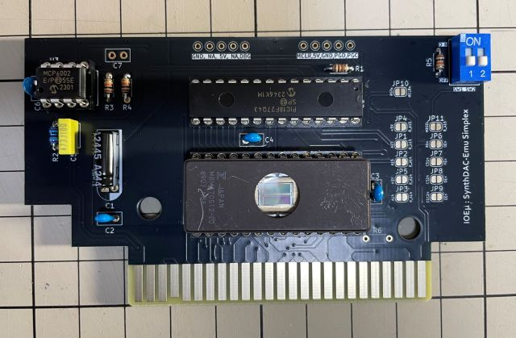
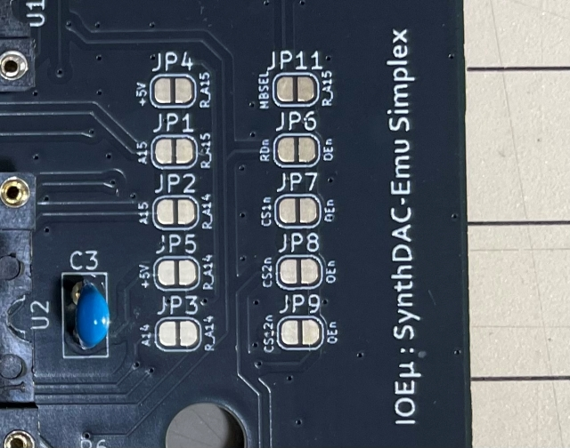

# IOEμ: SynthDAC-Emu Simplex

## 1. 概要

* SynthDAC-Emu Simplex(以下、SynthDAC-Emu)は、8-bit DAC機能を搭載した汎用のEPROM基板です。
* EPROMは、27C128、27C256、27C512に対応しています。※ EPROMの切り替えは基板のJP設定を変更。
* 64KBの27C512を使用する場合は、Z80の64KBのアドレス空間にそのまま割り当てることも出来ますが、32KBの2バンク構成で使用することも可能です。
* ROMバンクはディップスイッチで切り替え可能です。
* EPROMとROMライターをお持ちであれば自作のBASICプログラムをROMカートリッジ化して楽しめます。※ BASICプログラムのROM化方法はMSX2 テクニカルハンドブックに記載あります。
* 8-bit DACの出力は、アンプを経由してはMSXのスロットのSOUND-INに接続されていますので、DACをサウンド出力に使用出来ます。
* 8-bit DACのデータレジスタは、メモリマップドIOでメモリ領域に割り当てられています。
* DACのデータレジスタに任意の波形データを一定周期で連続で書き込むことによってサウンドを出力できます。
* SCCのような波形メモリやトーン生成機能はありませんので、ソフトウェアでサウンド波形を合成し、トーンを制御する必要があります。
* 新世Sizer(KONAMI'S SYNTHESIZER)をお持ちの方はROMのバックアップをEPROMに書き込み、SynthDAC-Emuに実装することでそのサウンドを再現することが出来ます。
* オリジナルの新世Sizerは飾ったままで、代わりにSynthDAC-Emuでそのサウンドを楽しめます。
* MSXバスのエミュレーションとDACの制御に8-bit PICマイコンを使用しています。※ 8bit-DACはPICマイコンに内蔵しています。
* IOEμシリーズとしては初めてMSXのバスアクセスはNo Waitで処理しています。※ 電源起動（ブート処理）時のみ、Waitを使用しています。
* 部品に入手性の良いDIPチップを採用しており、安価で組み立ても容易です。(秋月さんで部品は揃います)

## 2. 外観

## 3. 使用方法

### (1) EPROM
EPROMにプログラム等を書き込み、EPROMをSynthDAC-Emuに実装してください。使用するROM、アドレス空間に合わせてJP設定を変更してください。

基本的には、27C512(64KB)をDefalutのJP設定で使用し、ROMライターを使ってプログラム等のROMデータをMSXで使用するページ領域に指定して書き込む方法が簡単ですが、JP設定を変更することにより、27C128、27C256を使用することも、27C512を2バンク構成で使用することも可能です。JP設定は以下の表と写真を参照下さい。

* JP1、JP3、JP6はDefalutでSHORTですので、Defalut設定から変更する場合はこれらのJPパターンはCUTして下さい。
* JP10は常にNC（OPEN）にして下さい。JP10はEPROMの設定とは関係ありません。

#### JP設定

|EPROM|JP1|JP2|JP3|JP4|JP5|JP6|JP7|JP8|JP9|JP11|Z80のメモリ空間への割り当て
|--|--|--|--|--|--|--|--|--|--|--|--
|27C128 (16KB)|**CUT**|NC|**CUT**|SHORT|SHORT|**CUT**|SHORT|NC|NC|NC|0x4000-0x7FFF
|27C128 (16KB)|**CUT**|NC|**CUT**|SHORT|SHORT|**CUT**|NC|SHORT|NC|NC|0x8000-0xBFFF
|27C256 (32KB)|**CUT**|SHORT|**CUT**|SHORT|NC|**CUT**|NC|NC|SHORT|NC|0x4000-0xBFFF
|27C512 (64KB)|SHORT|NC|SHORT|NC|NC|SHORT|NC|NC|NC|NC|0x0000-0xFFFF (Default設定)
|27C512 (32KB x2banks)|**CUT**|SHORT|**CUT**|NC|NC|**CUT**|NC|NC|SHORT|SHORT|0x4000-0xBFFF ※2バンク切替式

#### ディップスイッチ設定

27C512使用時にJP設定で32KBの2バンク構成を選択した場合は、ディップスイッチのSW1を使用してバンクを切り替えることが出来ます。
尚、バンク機能を使用しない場合はディップスイッチの実装は不要です。

|SW#|OFF|ON|備考
|--|--|--|--
|SW1|EPROMのBOTTOM 32KB (0x8000-0xFFFF)|EPROMのTOP 32KB (0x0000-0x7FFF)| Z80のアドレス空間0x4000-0xBFFFに割り当てるROMの領域を選択します。
|SW2|-|-| 現時点で未使用です。OFFに設定してください。

### (2) DAC

DACのデータレジスタは、メモリマップドIOで以下のメモリアドレスに割り当てられています。

|アドレス|R/W|レジスタ・機能|備考
|--|--|--|--
|0x4000|W|8-bit dac data (unsigned)|リードに対してはEPROMのデータが読み出されます。
|0x4001-0x4FFF|W|0x4000のミラー|0x4000のミラーはライトアクセスのみ。リードに対してはリードアドレスに対応するEPROMのデータが読み出されます。

## 4. 使用上の注意

### (1) EPROM機能のみを使用する場合

DAC機能を使わずにROM機能（ROMのリード）のみを使用する場合は、PICマイコン(U1)やアンプ回路(U3)は実装不要です。

### (2) EPROMのアクセスタイム

EPROMはアクセスタイム 200ns以下(型番末尾-20等)の製品を使用してください。中古のEPROMを使用して動作検証した際に250ns品（型番末尾-25）のEPROMにおいて不具合が発生するMSXがありました（MSXの問題ではなく中古のEPROM側の問題かもしれません）。PICマイコンを実装する前にEPROMだけを実装し、EPROM単体でプログラムが正常に起動し動作するかを確認することをおすすめします。前述の通り、EPROMはPICマイコンが実装されていなくてもリードアクセス可能です。

## 5. PICマイコン用Firmwareの書き込み方法

SynthDAC用のファームウェア([HEXファイル](/SynthDAC-Emu_Simplex/firmware/))をPICマイコンに書き込む必要があります。

Device名は、「Advanced 8-bit MCUs(PIC18)」ファミリーの「**PIC18F27Q43**」です。
オンボードでの書き込み方法は、DCSG-Emuの[Readme](/DCSG-Emu_Simplex/readme_dcsg-emu.md)を参考にしてください。
**オンボードでの書き込みは必ずMSX本体からSynthDAC-Emuを取り外した状態で行ってください。故障原因になります。**

## 6. 基板の発注方法

基板の発注方法を例示しますが、利用者の責任において実施して下さい。[IOEμの免責事項](../readme.md)を参照下さい。

基板メーカーに[JLCPCB](https://jlcpcb.com/jp)を使用される場合は、gerberフォルダ内のZIPファイル（[ガーバーファイル](/SynthDAC-Emu_Simplex/gerber/))してください。

主な基板仕様は以下の通りです。

* 寸法：ガーバーファイル（ZIPファイル）のアップロードで自動入力されます。
* 層数：2層
* PCB厚さ：1.6mm
* 表面仕上げ：お好みで。ENIGは品質が良いですが、費用は高くなります。
* ビア処理：レジストカバー
* カードエッジコネクタ：YES (表面仕上げでENIGを使用しない場合もYESとしてください)
* 30°端子取り：YES
* 端面スルーホール：No
* エッジメッキ：No

その他の項目はお好みで設定ください。

